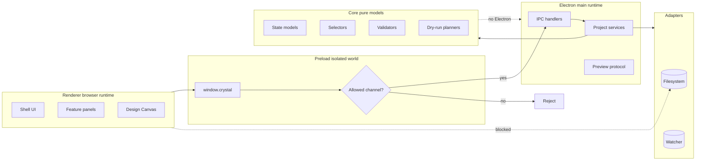

# Runtime Boundaries

[Docs index](../README.md)

## At a glance

| Question | Answer |
| --- | --- |
| Is this implemented? | Yes, through Electron main/preload/renderer separation. |
| Can renderer write files? | No. |
| Runtime owner | Main owns privileged effects; preload owns bridge exposure; renderer owns UI. |
| Safety risk controlled | Prevents UI or Preview content from gaining desktop authority. |
| Related next phase | Future runtimes must use explicit typed ports. |

## Purpose

Crystal runs trusted desktop code next to untrusted project HTML. Runtime boundaries define where authority lives so that a renderer panel, a loaded Preview page, or a future editing affordance cannot accidentally become a filesystem-capable process.

## Why this exists

Electron apps can become unsafe when renderer convenience overrides process boundaries. Crystal keeps effects behind main/adapters and keeps renderer as a browser UI runtime.

## How to read this page

| If you are changing | Check |
| --- | --- |
| BrowserWindow options | [Security model](./security-model.md) first. |
| Preload API | IPC constants and bridge surface. |
| Renderer component | It should not import main services or adapters. |
| Core package | It should stay portable and Electron-free. |

## Current implementation

There are three implemented Electron runtimes. Main owns lifecycle, windows, IPC handlers, filesystem-backed project services, watcher lifecycle, DOM Snapshot source reads, and the Preview protocol. Preload exposes a narrow `window.crystal` API. Renderer owns browser UI composition and local interaction state.

| Implemented | Blocked | Future |
| --- | --- | --- |
| Main/preload/renderer split. | Raw renderer filesystem access. | Dedicated workers. |
| Controlled `window.crystal` API. | Raw `ipcRenderer` exposure. | WASM analyzer runtime. |
| Core pure models and selectors. | Core importing Electron. | WebGPU overlay runtime. |

## Key files

These files trace the boundary from window creation to renderer API calls.

## Key files and responsibilities

| File | Responsibility | Reads | Must not do |
| --- | --- | --- | --- |
| `apps/desktop/electron/main/windows/create-main-window.ts` | Creates BrowserWindow. | Security preferences. | Relax sandbox for convenience. |
| `apps/desktop/electron/main/security/web-preferences.ts` | Defines hardened web preferences. | Electron config. | Enable Node integration. |
| `apps/desktop/electron/preload/bridges/crystal-api.bridge.ts` | Exposes constrained API. | IPC constants. | Expose raw IPC. |
| `packages/shared/constants/ipc.constants.ts` | Names IPC channels. | Shared contracts. | Add write channels without policy. |
| `apps/desktop/electron/renderer/main.ts` | Starts renderer runtime. | Browser modules. | Import main/adapters. |

## Data flow

| Input | Decision | Output |
| --- | --- | --- |
| Renderer request | Is it in the preload API? | Typed IPC call or no access. |
| IPC request | Does main own the effect? | Main service result. |
| Core request | Is it pure model/planning work? | Portable result. |
| Adapter request | Is an effect required? | Filesystem or watcher operation behind main. |

## Main diagram

The diagram separates runtime authority. Dotted edges are shortcuts the architecture blocks.

## Boundaries

Renderer must not import Node filesystem primitives or main services. Main must not leak arbitrary filesystem methods through preload. Preload must not expose raw IPC. Core packages should not depend on Electron runtime APIs.

> **Safety boundary:** Runtime ownership is part of the security model, not only code organization.

## What this does not do

| Not provided | Reason |
| --- | --- |
| Worker/WASM/WebGPU runtime contracts | Future phases only. |
| Renderer-side write authority | Would bypass main/core validation. |
| Direct Preview DOM access | Would couple UI to untrusted project content. |

## Common misunderstanding

> **Common misunderstanding:** A renderer component may import shared types or pure selectors, but it must not import the service that performs privileged effects.

## Validation

`validate:structure` checks the broad source layout. Feature validators add narrower guardrails around Preview, Selection, Inspector, Design Canvas, Element Library, and Source Patch Preview behavior.

## Related docs

- [Security model](./security-model.md)
- [Preview safety](./preview/preview-safety.md)
- [Runtime boundaries diagram](./diagrams/runtime-boundaries.md)
- [Module boundaries](./module-boundaries.md)

## Future work

Workers, WASM, and WebGPU should be introduced as explicit runtimes with typed ports. They should not become a side channel around preload/main security, and they should not give renderer direct write authority.
