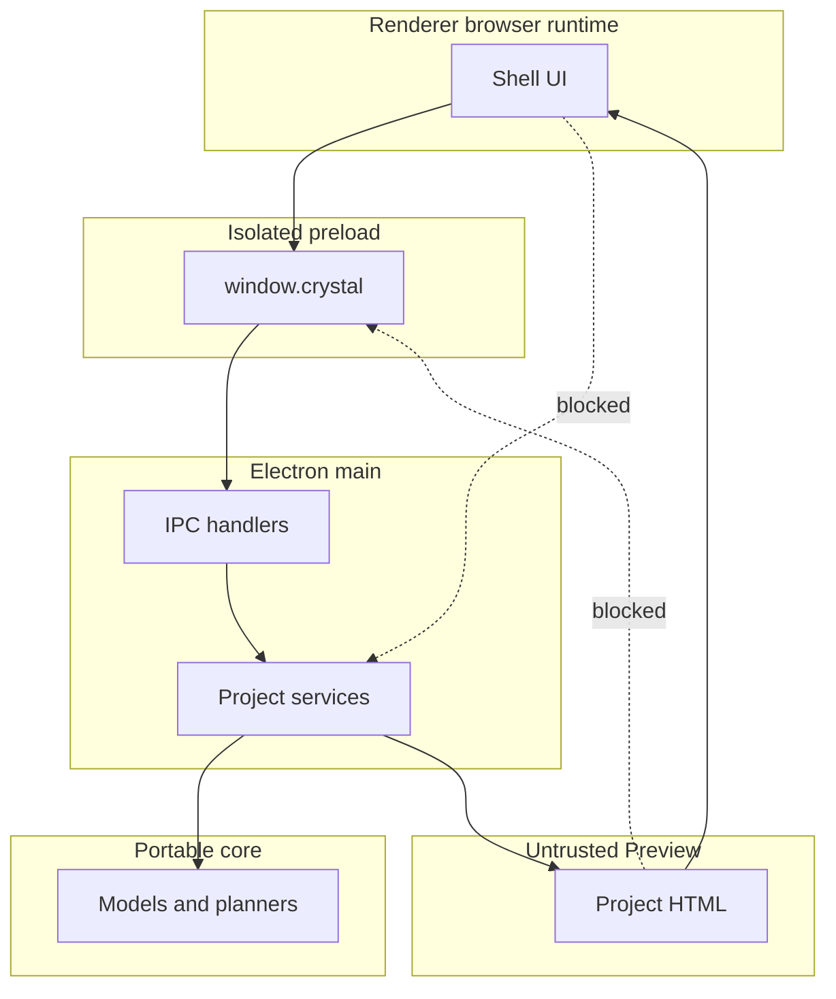

# Runtime boundaries

[Docs index](../README.md)

## At a glance

| Question | Answer |
| --- | --- |
| Main | Owns lifecycle, IPC handlers, project services, and protocol serving. |
| Preload | Exposes a narrow typed API. |
| Renderer | Owns browser UI and local interaction state. |
| Preview iframe | Renders untrusted project content in isolation. |
| Core and adapters | Separate semantic logic from effects. |

## Purpose

Crystal runs trusted desktop code beside arbitrary project HTML. Runtime boundaries define which code may hold authority so a UI shortcut or project script cannot become a filesystem operation.

## Current implementation

Electron main registers application and project IPC, the custom Preview protocol, dialogs, filesystem-backed project services, watcher lifecycle, and source reads. Preload exposes only named methods on `window.crystal`. Renderer composes the shell. The iframe sends bounded selection messages but cannot call Crystal APIs.

## Key files

The following paths are the shortest reliable entry points. They are not a substitute for following the data flow through the subsystem.

## Key files and responsibilities

| File or path | Responsibility | Reads | Must not do |
| --- | --- | --- | --- |
| `apps/desktop/electron/main/windows/create-main-window.ts` | Creates the hardened BrowserWindow. | security preferences | relax runtime isolation |
| `apps/desktop/electron/main/security/web-preferences.ts` | Defines Electron security options. | static options | enable Node integration |
| `apps/desktop/electron/preload/bridges/crystal-api.bridge.ts` | Maps typed methods to allowed channels. | shared IPC contracts | expose raw ipcRenderer |
| `packages/shared/constants/ipc.constants.ts` | Names current channels. | cross-runtime contract | add implicit write channels |
| `apps/desktop/electron/renderer/main.ts` | Starts renderer code. | browser modules | import main effects |

## Data flow

| Input | Decision | Output |
| --- | --- | --- |
| Renderer request | Is the method exposed by preload? | Typed IPC or no access |
| IPC payload | Does main validate and own the effect? | Service result or rejection |
| Core computation | Can it operate on plain data? | Portable model result |
| Preview message | Is source window and payload valid? | Sanitized selection candidate or ignored input |

## Boundaries

Renderer does not import Node, main services, or filesystem adapters. Preload does not expose generic send/invoke primitives. Core logic does not depend on Electron. The Preview iframe is not trusted renderer UI.

> **Safety boundary:** State that crosses a boundary is evidence to validate, not authority to perform a privileged effect.

## What this does not do

| Not provided | Why |
| --- | --- |
| Renderer write authority | No filesystem or write IPC is exposed. |
| Raw iframe DOM access | Selection uses bounded messages and source-derived mapping. |
| Worker/WASM/WebGPU runtime contracts | They remain future and must receive explicit ports. |
| Complete import enforcement | Physical ownership is enforced; dependency analysis remains partial. |

## Common misunderstanding

> **Common misunderstanding:** Sharing a process family in Electron does not make every runtime equally trusted. Renderer, preload, main, and the Preview iframe have different authority.

## Validation

`validate:structure`, `validate:source-tree-boundaries`, `validate:ui-flow`, and focused Preview validators cover current boundaries. Security-sensitive changes also require manual review.

## Related docs

- [Security model](./security-model.md)
- [Module boundaries](./module-boundaries.md)
- [Preview safety](./preview/preview-safety.md)
- [Runtime boundaries diagram](./diagrams/runtime-boundaries.md)

## Future work

Workers and accelerators should be introduced as named runtimes with typed messages, bounded outputs, fallback behavior, and no path around main-owned effects.
