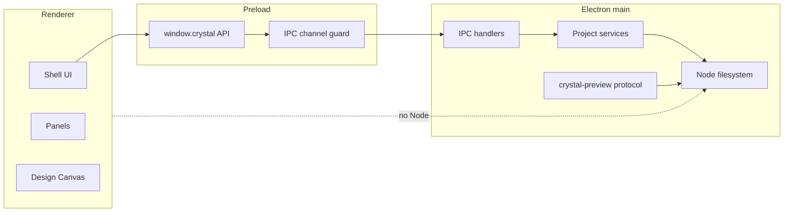

# Runtime Boundaries

[Docs index](../README.md)

## Purpose

This document defines the current runtime contexts and the allowed communication paths between them.

## Current implementation

Crystal runs with three implemented Electron contexts:

- Electron main process: application lifecycle, windows, IPC handlers, filesystem adapters, Project Graph service wiring, Preview protocol, DOM Snapshot source service, watcher lifecycle.
- Preload: controlled `window.crystal` API exposed through `contextBridge`.
- Renderer: HTML/CSS/TypeScript UI shell and read-only project panels.

Future contexts such as workers, Rust/WASM, and WebGPU engines are planned but not implemented as runtime engines yet.

## Key files

- `apps/desktop/electron/main/main.ts`
- `apps/desktop/electron/main/windows/create-main-window.ts`
- `apps/desktop/electron/main/security/web-preferences.ts`
- `apps/desktop/electron/preload/preload.ts`
- `apps/desktop/electron/preload/bridges/crystal-api.bridge.ts`
- `apps/desktop/electron/renderer/main.ts`
- `packages/shared/constants/ipc.constants.ts`
- `packages/shared/types/ipc.types.ts`

## Data flow

Renderer code calls `window.crystal.project.*` or `window.crystal.app.*`. Preload routes only known channels and provides subscription teardown functions. Electron main handles the actual operation, updates in-memory state, and emits typed update events back through IPC. Renderer panels subscribe and re-render from sanitized state.

## Boundaries

Renderer must not import Node built-ins for project IO. Main must not expose arbitrary filesystem primitives to renderer. Preload must not expose raw `ipcRenderer`. Preview iframe must not be treated as trusted renderer UI. Core packages must not depend on Electron runtime APIs.

## Validation

Runtime boundary assumptions are guarded by `scripts/validate-structure.mjs`, feature validators, and security-specific checks embedded in Preview, Selection, Inspector, Design Canvas, Element Library, and Source Patch Preview validators.

## Related docs

- [Security model](./security-model.md)
- [Preview safety](./preview/preview-safety.md)
- [Runtime boundaries diagram](./diagrams/runtime-boundaries.md)
- [Module boundaries](./module-boundaries.md)

## Future work

Future workers, WASM, and WebGPU contexts must be introduced behind typed ports and adapters. They must not bypass main/preload security rules or give renderer direct write authority.
