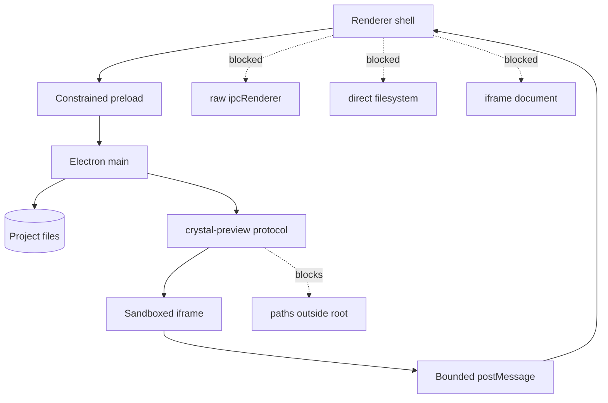

# Security model

[Docs index](../README.md)

## At a glance

| Question | Answer |
| --- | --- |
| BrowserWindow hardening | `contextIsolation: true`, `nodeIntegration: false`, `sandbox: true`, `webSecurity: true`. |
| Preload exposure | Named typed methods only. |
| Preview serving | Project-root-contained custom protocol. |
| Selection transport | Bounded postMessage payloads with repeated validation. |
| Writes | No write contract exists. |

## Purpose

Crystal must render projects that may contain broken markup, scripts, remote references, or hostile content while retaining access to local project files. The security model keeps the rendered page useful without making it privileged.

## Current implementation

Main creates the application window from the hardened preference object. Preload exposes `window.crystal` rather than raw IPC. Preview resources are resolved inside the active project root. Static source feeds DOM Snapshot; renderer never relies on `iframe.contentDocument` or `iframe.contentWindow.document`. Selection messages are checked at the renderer boundary and again before core mapping.

## Key files

The following paths are the shortest reliable entry points. They are not a substitute for following the data flow through the subsystem.

## Key files and responsibilities

| File or path | Responsibility | Reads | Must not do |
| --- | --- | --- | --- |
| `apps/desktop/electron/main/security/web-preferences.ts` | Defines hardened window preferences. | Electron options | disable sandbox or web security |
| `apps/desktop/electron/preload/bridges/crystal-api.bridge.ts` | Exposes the controlled API. | allowed channel set | expose arbitrary IPC |
| `apps/desktop/electron/main/preview/project-preview-protocol.ts` | Contains Preview reads to the active root. | normalized project-relative paths | serve traversal or outside-root paths |
| `project-preview-selection-message-bridge.ts` | Checks iframe message origin and shape. | MessageEvent data | read the iframe document |
| `project-preview-selection-service.ts` | Validates and stores bounded selection state. | candidate payloads | trust renderer blindly |

## Data flow

| Input | Decision | Output |
| --- | --- | --- |
| Preview URL | Does it normalize inside the active root? | Resource or sanitized issue |
| Renderer call | Is the method exposed and channel valid? | Main request or no access |
| Iframe message | Is the source window and payload expected? | Candidate state or ignored input |
| Future edit intent | Does an explicit write runtime exist? | Currently blocked |

## Boundaries

Do not weaken window or iframe isolation to obtain easier inspection. Missing information should become a better bounded model or explicit unsupported state. Future persistence must add authority behind main/core gates rather than exposing it to renderer or project code.

> **Safety boundary:** State that crosses a boundary is evidence to validate, not authority to perform a privileged effect.

## What this does not do

| Not provided | Why |
| --- | --- |
| Arbitrary local file serving | The protocol is scoped to the active project root. |
| Live iframe inspection | Renderer does not read iframe internals. |
| Project-content privilege | The page cannot call Crystal or Node APIs. |
| Write IPC | No current channel performs project mutation. |

## Common misunderstanding

> **Common misunderstanding:** Security options are not incidental Electron configuration. They define who may hold authority and therefore constrain every future editing design.

## Validation

Preview, selection, Inspector, source-patch, UI-flow, and architecture validators check forbidden shortcuts. Review `web-preferences.ts`, preload exposure, and protocol containment for every security-sensitive change.

## Related docs

- [Runtime boundaries](./runtime-boundaries.md)
- [Preview safety](./preview/preview-safety.md)
- [Security boundaries diagram](./diagrams/security-boundaries.md)
- [ADR 0001](../decisions/0001-electron-security-boundaries.md)

## Future work

A write runtime may need additional source information, but it must obtain it through validated main/core services. It must not rely on same-origin iframe access or renderer filesystem helpers.
