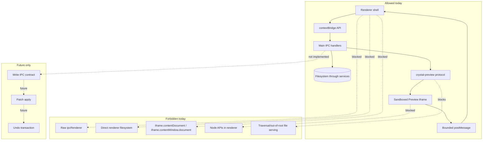

# Security Model

[Docs index](../README.md)

## At a glance

| Question | Answer |
| --- | --- |
| Is this implemented? | Yes, through hardened Electron preferences, constrained preload, and safe Preview serving. |
| Can Preview content access Crystal privileges? | No. |
| Runtime owner | Main process owns privileged filesystem and protocol decisions. |
| Safety risk controlled | Prevents project HTML, renderer bugs, or UI shortcuts from escalating to filesystem authority. |
| Related next phase | Future write paths must add gates without weakening Preview isolation. |

## Purpose

Crystal must display arbitrary project HTML while also managing local files. The security model keeps those facts from colliding: a page loaded in Preview may contain scripts, broken markup, remote references, or hostile code, but it must never inherit Crystal's desktop privileges.

## Why this exists

The highest-risk future work is visual editing. Before editing exists, Crystal needs stable boundaries that prevent renderer UI and project HTML from becoming privileged code.

## How to read this page

| Concern | Relevant boundary |
| --- | --- |
| Renderer privilege | BrowserWindow preferences and preload shape. |
| Project file serving | `crystal-preview://` root containment. |
| Selection messages | Bounded `postMessage` payloads and validation. |
| Future writes | Main/core write services only after explicit contracts exist. |

## Current implementation

Main creates the BrowserWindow with `contextIsolation: true`, `nodeIntegration: false`, `sandbox: true`, and `webSecurity: true`. Preload exposes only the typed `window.crystal` surface. Project files for Preview are served through `crystal-preview://current/<relative-project-path>` after main resolves each request against the active project root.

| Implemented | Blocked | Future |
| --- | --- | --- |
| Hardened BrowserWindow preferences. | Renderer Node access. | Write-gated main/core persistence. |
| Constrained preload API. | Raw IPC exposure. | Transaction-aware write IPC if designed. |
| Root-contained Preview protocol. | Traversal/out-of-root reads. | Additional safe protocol diagnostics. |
| Bounded selection messages. | Live iframe document reads. | Richer selection states with same isolation. |

## Key files

These files are the security entry points. Read them before changing BrowserWindow options, preload shape, Preview serving, or selection messages.

## Key files and responsibilities

| File | Responsibility | Reads | Must not do |
| --- | --- | --- | --- |
| `apps/desktop/electron/main/security/web-preferences.ts` | Defines hardened web preferences. | Electron option constants. | Enable Node integration or disable sandbox. |
| `apps/desktop/electron/preload/bridges/crystal-api.bridge.ts` | Exposes controlled API. | IPC channel contracts. | Expose raw `ipcRenderer`. |
| `apps/desktop/electron/main/preview/project-preview-protocol.ts` | Serves active-root resources. | Active project root and safe paths. | Serve traversal or outside-root paths. |
| `apps/desktop/electron/main/preview-selection/project-preview-selection-service.ts` | Validates selection state in main. | Bounded payloads. | Trust renderer blindly. |
| `apps/desktop/electron/renderer/components/project-preview-panel/selection/project-preview-selection-message-bridge.ts` | Receives iframe selection messages. | Source window and message shape. | Read iframe DOM directly. |

## Data flow

| Input | Decision | Output |
| --- | --- | --- |
| Renderer IPC call | Is the channel exposed by preload? | Allowed main request or no access. |
| Preview URL | Is the path normalized and inside the active root? | Served resource or sanitized issue. |
| Iframe selection message | Is source window and payload shape valid? | Bounded selected-node state. |
| Future write request | Is there an explicit write contract? | Currently blocked. |

## Main diagram

Allowed paths are solid. Forbidden shortcuts are dotted. Future write work is shown as a separate blocked area, not as a current edge.

## Boundaries

`nodeIntegration: false` prevents renderer scripts from importing Node. `contextIsolation: true` prevents the page context from mutating the preload environment. `sandbox: true` limits renderer process privileges. `webSecurity: true` preserves browser security checks. Avoiding `iframe.contentDocument` and `iframe.contentWindow.document` prevents renderer code from depending on same-origin access to project HTML.

> **Safety boundary:** Do not relax Electron or iframe security to make inspection easier. Inspection must use bounded state and main/core validation.

## What this does not do

| Not provided | Reason |
| --- | --- |
| File mutation | No write runtime exists. |
| Live DOM inspection from renderer | Would weaken Preview isolation. |
| Arbitrary local file serving | Preview protocol is project-root scoped. |
| Editable Inspector | Would require command execution and history. |

## Common misunderstanding

> **Common misunderstanding:** The Preview iframe rendering a project page does not mean renderer can safely inspect or mutate that page's live DOM.

## Validation

Security-sensitive validators look for forbidden iframe access, write-channel shortcuts, and DOM mutation patterns. `validate:source-patch-preview` guards the line between previewing a possible source edit and applying one.

## Related docs

- [Preview safety](./preview/preview-safety.md)
- [Runtime boundaries](./runtime-boundaries.md)
- [Security boundaries diagram](./diagrams/security-boundaries.md)
- [ADR 0001](../decisions/0001-electron-security-boundaries.md)

## Future work

Future write-capable flows must add validation and transaction layers without weakening these protections. A write runtime may need more information, but it should get that information through main/core services, not by trusting the Preview iframe or giving renderer raw filesystem access.
