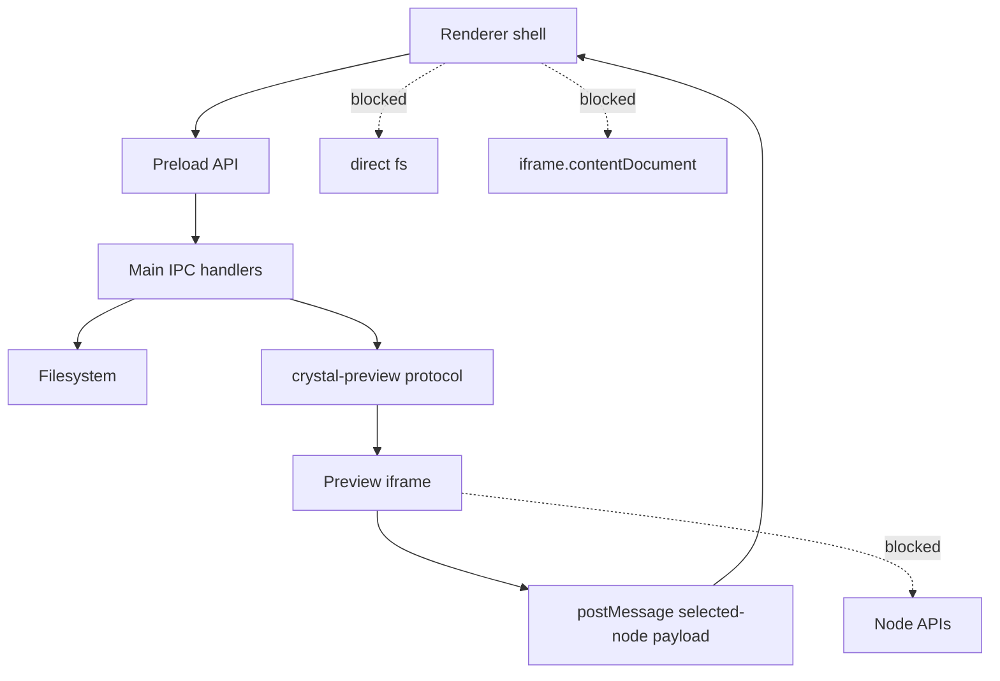

# Security Model

[Docs index](../README.md)

## Purpose

Crystal must display arbitrary project HTML while also managing local files. The security model exists to keep those two facts from colliding. A page loaded in Preview may contain scripts, broken markup, remote references, or hostile code; it must never inherit Crystal's desktop privileges.

## Current implementation

Main creates the BrowserWindow with `contextIsolation: true`, `nodeIntegration: false`, `sandbox: true`, and `webSecurity: true`. Preload exposes only the typed `window.crystal` surface. Project files for Preview are served through `crystal-preview://current/<relative-project-path>` after main resolves each request against the active project root. Selection data crosses from the iframe to renderer as bounded `postMessage` payloads and is validated again in main.

The diagram highlights the allowed bridge and the blocked shortcuts. The dotted edges are risks the architecture explicitly avoids.

## Key files

These files are the security entry points. Read them before changing BrowserWindow options, preload shape, Preview serving, or selection messages.

- `apps/desktop/electron/main/security/web-preferences.ts`
- `apps/desktop/electron/main/windows/create-main-window.ts`
- `apps/desktop/electron/preload/bridges/crystal-api.bridge.ts`
- `apps/desktop/electron/main/preview/project-preview-protocol.ts`
- `apps/desktop/electron/main/preview-selection/project-preview-selection-service.ts`
- `apps/desktop/electron/renderer/components/project-preview-panel/selection/project-preview-selection-message-bridge.ts`
- `packages/shared/constants/ipc.constants.ts`
- `packages/shared/validators/ipc-channel.validator.ts`

## Data flow

A renderer request crosses preload, reaches a named IPC handler, and is resolved by main. Preview resource requests are normalized, checked for active-root containment, and served or rejected with sanitized issues. Selection messages leave the iframe only as small summaries; they are not treated as trusted source identities until core mapping confirms them against the DOM Snapshot.

## Boundaries

`nodeIntegration: false` prevents renderer scripts from importing Node. `contextIsolation: true` prevents the page context from mutating the preload environment. `sandbox: true` limits renderer process privileges. `webSecurity: true` preserves browser security checks. Avoiding `iframe.contentDocument` and `iframe.contentWindow.document` prevents renderer code from depending on same-origin access to project HTML. Rejecting traversal and outside-root paths prevents Preview URLs from becoming arbitrary file reads.

## Validation

Security-sensitive validators look for forbidden iframe access, write-channel shortcuts, and DOM mutation patterns. `validate:source-patch-preview` is especially important because it guards the line between previewing a possible source edit and applying one.

## Related docs

- [Preview safety](./preview/preview-safety.md)
- [Runtime boundaries](./runtime-boundaries.md)
- [Security boundaries diagram](./diagrams/security-boundaries.md)
- [ADR 0001](../decisions/0001-electron-security-boundaries.md)

## Future work

Future write-capable flows must add validation and transaction layers without weakening these protections. A write runtime may need more information, but it should get that information through main/core services, not by trusting the Preview iframe or giving renderer raw filesystem access.
