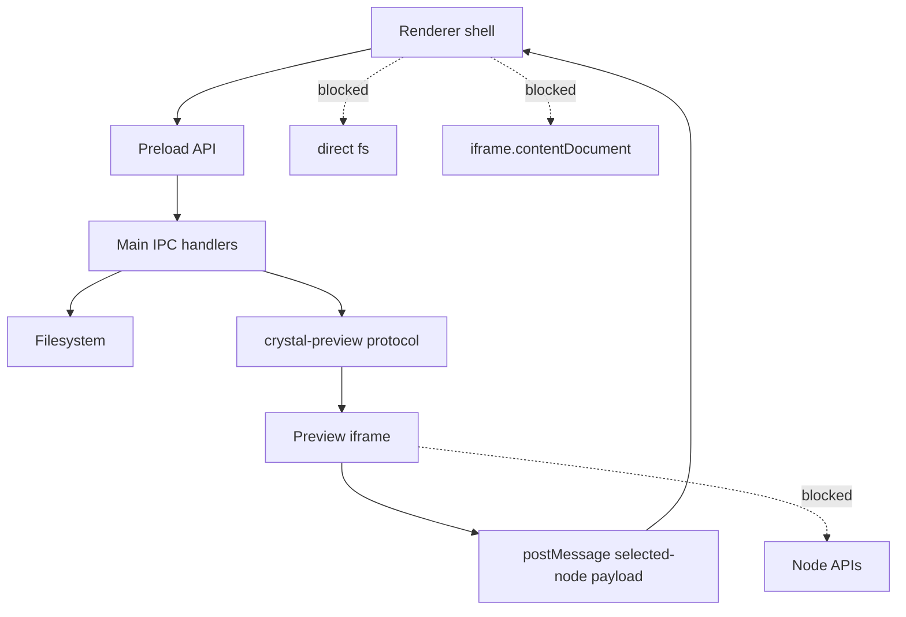

# Security Model

[Docs index](../README.md)

## Purpose

This document defines the security boundaries that must remain intact while Crystal evolves from read-only preview toward future editing.

## Current implementation

Electron main creates the BrowserWindow with hardened preferences: `contextIsolation: true`, `nodeIntegration: false`, `sandbox: true`, and `webSecurity: true`. Preload exposes only the `window.crystal` API. The Preview iframe is served through a custom `crystal-preview://current/<relative-project-path>` protocol resolved against the active Project Graph root. Preview selection uses a bounded message bridge and does not require reading the iframe DOM from renderer.

## Key files

- `apps/desktop/electron/main/security/web-preferences.ts`
- `apps/desktop/electron/main/windows/create-main-window.ts`
- `apps/desktop/electron/preload/bridges/crystal-api.bridge.ts`
- `apps/desktop/electron/main/preview/project-preview-protocol.ts`
- `apps/desktop/electron/main/preview-selection/project-preview-selection-service.ts`
- `apps/desktop/electron/renderer/components/project-preview-panel/selection/project-preview-selection-message-bridge.ts`
- `packages/shared/constants/ipc.constants.ts`
- `packages/shared/validators/ipc-channel.validator.ts`

## Data flow

Main controls privileged operations. Preload validates and invokes only known channels. Renderer renders sanitized state and sends bounded requests. Preview protocol requests are resolved to safe project-relative paths and rejected when traversal, outside-root access, read failure, unsupported request shape, or stale target state is detected.

## Boundaries

The renderer must not use `fs`, `path`-based project reads, write APIs, raw IPC, `iframe.contentDocument`, `iframe.contentWindow.document`, `.contentDocument`, `.contentWindow.document`, `insertAdjacentHTML`, `contenteditable`, or `execCommand`. Security cannot be relaxed to simplify UI features. If a future feature needs more data, it must receive sanitized data through main/core services.

## Validation

Security boundaries are checked by source validators that look for forbidden iframe access, write channels, DOM mutation patterns, and execution shortcuts. `validate:source-patch-preview` specifically guards the Phase 6B dry-run boundary.

## Related docs

- [Preview safety](./preview/preview-safety.md)
- [Runtime boundaries](./runtime-boundaries.md)
- [Security boundaries diagram](./diagrams/security-boundaries.md)
- [ADR 0001](../decisions/0001-electron-security-boundaries.md)

## Future work

Future write-capable features must still preserve Electron isolation. Write execution belongs behind command validation, source patch application, undo/redo transaction state, dirty-state workflow, and main/core persistence services. No future phase should make the Preview document a trusted privileged context.
