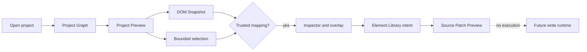

# System overview

[Docs index](../README.md)

## At a glance

| Question | Answer |
| --- | --- |
| Current product shape | Desktop workbench for real HTML projects. |
| Implemented interaction | Read-only inspection and dry-run planning. |
| Source writes | Intentionally unavailable. |
| Style knowledge | Authored inventory and conservative snapshot candidates only. |
| Roadmap status | Tracked separately from current implementation. |

## Purpose

A new contributor first needs a truthful picture of the current product loop. Crystal can open, render, map, inspect, and preview possible changes; it cannot persist them.

## Current implementation

Opening a project produces a Project Graph. A selected page is served to Chromium through `crystal-preview://`, while static source is parsed into a DOM Snapshot. A bounded click can become trusted selection only after defensive mapping. Inspector and overlay state derive from that mapping. The Element Library can then describe a possible insertion as Source Patch Preview. History, refresh, editing, and style models add readiness information but do not execute effects.

## Key files

The following paths are the shortest reliable entry points. They are not a substitute for following the data flow through the subsystem.

## Key files and responsibilities

| File or path | Responsibility | Reads | Must not do |
| --- | --- | --- | --- |
| `packages/core/project` | Project, Preview, Snapshot, selection, Inspector, and canvas models. | source-derived state | write files |
| `apps/desktop/electron/main` | Privileged orchestration. | typed IPC and adapters | delegate authority to project HTML |
| `apps/desktop/electron/renderer` | Product shell and panels. | sanitized state | perform IO |
| `packages/core/commands` | Command intent and preview planning. | validated context | execute commands |
| `packages/core/style-engine` | Style inventory and authored matching previews. | caller-supplied text and snapshot data | claim browser cascade truth |

## Data flow

| Input | Decision | Output |
| --- | --- | --- |
| Project root | Can main resolve and scan it? | Project Graph |
| Graph page | Can main serve it inside the active root? | Preview state and URL |
| Static HTML | Can core build a bounded tree? | DOM Snapshot and issues |
| Visual click | Can snapshot data confirm it? | Matched or defensive selection |
| Edit intent | Can a safe dry-run be described? | Preview result or blocked state |

## Boundaries

The current loop ends at a model or renderer surface. Transaction previews are not transaction records, refresh plans do not refresh, disabled Inspector fields do not edit, and authored style candidates do not represent applied browser styles.

> **Safety boundary:** State that crosses a boundary is evidence to validate, not authority to perform a privileged effect.

## What this does not do

| Not provided | Why |
| --- | --- |
| Patch application | No writer consumes Source Patch Preview. |
| Undo/redo execution | History is descriptive planning only. |
| Refresh after mutation | No mutation occurs and refresh execution is absent. |
| Editable style Inspector | Current CSS/Sass surfaces remain passive and read-only. |

## Common misunderstanding

> **Common misunderstanding:** The application can be substantial and interactive while still being read-only at the project boundary. Navigation, selection, inspection, and previews are not disguised writes.

## Validation

Feature validators guard each edge of the loop. `validate:local:quick` runs all 32 required checks through the strict reporter.

## Related docs

- [Project open flow](./flows/project-open-flow.md)
- [Preview architecture](./preview/README.md)
- [Commands architecture](./commands/README.md)
- [Implementation status](../roadmap-implementation.md)

## Future work

The next major capability boundary is a coherent write runtime with freshness checks, persistence, executable history, dirty state, and refresh orchestration. Individual editing controls should not precede it.
