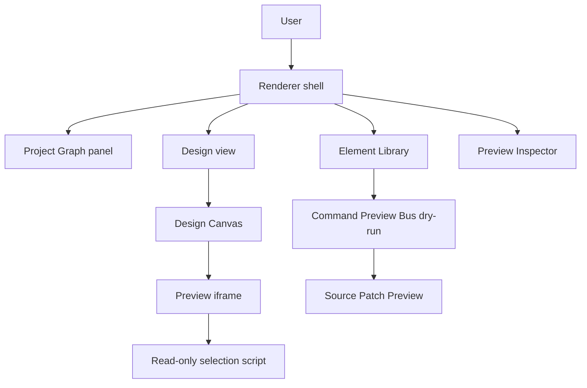

# System Overview

[Docs index](../README.md)

## Purpose

Crystal is being built as a desktop workbench for real HTML projects, not as a closed visual-builder format. The system overview exists to keep that product shape visible while the codebase grows: the renderer presents tools, main owns privileged access, core models the project, and current command work stops at preview rather than mutation.

## Current implementation

The implemented surface is a read-only project analysis and preview pipeline plus dry-run command planning. A user can open a project, inspect the Project Graph, load a page through the custom Preview protocol, build a static DOM Snapshot, select a node in the rendered page, inspect the mapped structure, view an external selection overlay, and ask the Element Library to describe a possible insertion.

The graph below shows the current product loop. The important edge is the last one: Element Library intent reaches a dry-run preview, not a writer.

## Key files

These files are the best starting points for following the system from boot to feature panels. They are not the only files involved; each subsystem has deeper docs linked below.

- `README.md`
- `docs/roadmap-implementation.md`
- `apps/desktop/electron/main/main.ts`
- `apps/desktop/electron/renderer/views/design/design.html`
- `apps/desktop/electron/renderer/components/html-element-library-panel/html-element-library-panel.ts`
- `packages/core/commands/command-preview-bus/command-preview-bus.preview.ts`
- `packages/core/source-patch/html-source-anchor.selectors.ts`

## Data flow

Opening a folder or HTML file gives main an active project root. Core scanning builds Project Graph state from that root. Preview target selection then narrows the graph to one HTML page and main serves it through `crystal-preview://current/...`. DOM Snapshot reads the static source for that target. Preview Selection reports a bounded visual click. Mapping decides whether that click is trustworthy enough to relate back to the static source model. Element Library preview planning uses that mapped state only to describe a possible insertion.

## Boundaries

The current system does not edit project files. That is not an omission in the UI copy; it is an architectural boundary. Source writes require more than a snippet preview: Crystal still needs command execution policy, source freshness checks, patch application, undo transaction records, dirty-state tracking, and refresh invalidation before a write path is safe.

## Validation

Runtime behavior is guarded by the existing feature validators. This documentation set is guarded by `scripts/validate-architecture-docs.mjs`, which checks that the architecture docs stay linked, diagrammed, and explicit about blocked write behavior.

## Related docs

- [Repository map](./repository-map.md)
- [Runtime boundaries](./runtime-boundaries.md)
- [Security model](./security-model.md)
- [Project open flow](./flows/project-open-flow.md)
- [Future write flow](./flows/future-write-flow.md)

## Future work

Phase 6C should add the contracts that make a later write runtime possible: transaction skeletons and refresh-boundary planning. It should still leave actual file writes, patch application, write IPC, DOM mutation, and real undo/redo unavailable.
