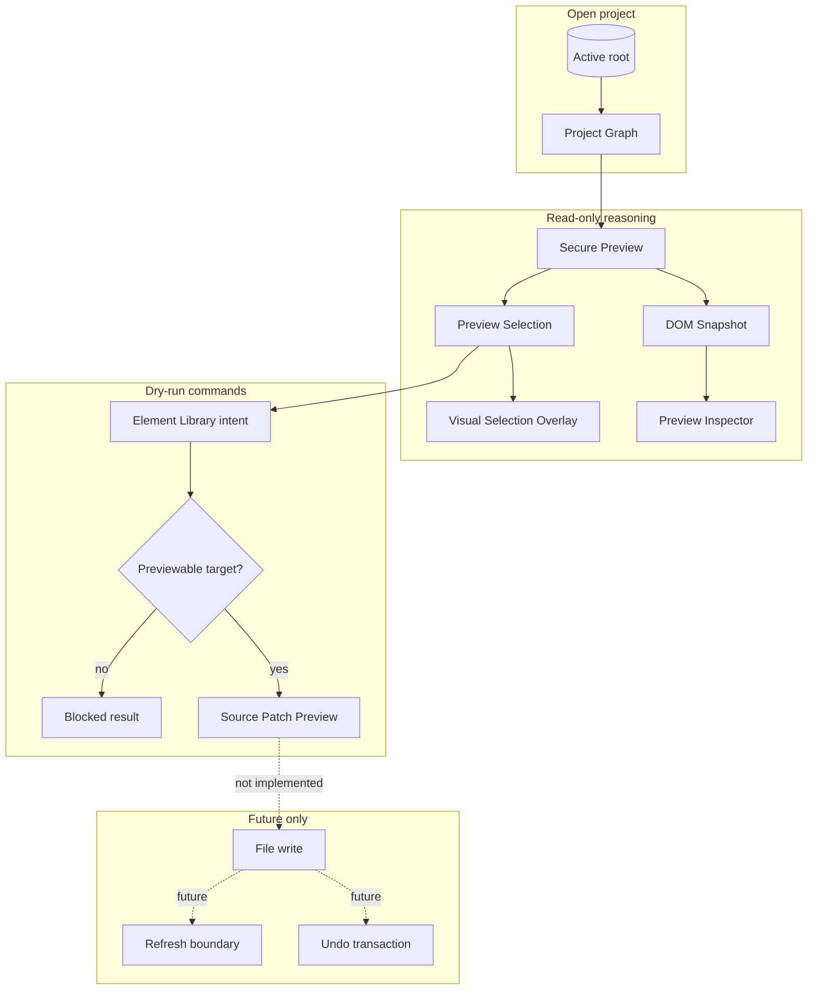

# System Overview

[Docs index](../README.md)

## At a glance

| Question | Answer |
| --- | --- |
| Is this implemented? | Yes, as read-only and dry-run infrastructure. |
| Can it write source files? | No. |
| Runtime owner | Renderer for UI, main for effects, core for models and planning. |
| Safety risk controlled | Prevents rendered selection or command previews from becoming implicit mutation. |
| Related next phase | Phase 6C transaction and refresh-boundary planning. |

## Purpose

Crystal is being built as a desktop workbench for real HTML projects, not as a closed visual-builder format. The system overview keeps that product shape visible while the codebase grows.

## Why this exists

New contributors need to know what Crystal can do today before reading individual modules. The most important distinction is current read-only/dry-run capability versus future source mutation.

## How to read this page

| Section | Use it for |
| --- | --- |
| Current implementation | Scope of implemented foundations. |
| Key files and responsibilities | Entry points for tracing code. |
| Data flow | What state enters, what decision is made, what leaves. |
| Main diagram | Runtime and feature-level orientation. |
| What this does not do | Explicit blocked features. |

## Current implementation

The implemented surface is a read-only project analysis and preview pipeline plus dry-run command planning. A user can open a project, inspect the Project Graph, load a page through the custom Preview protocol, build a static DOM Snapshot, select a node in the rendered page, inspect the mapped structure, view an external selection overlay, and ask the Element Library to describe a possible insertion.

| Implemented | Blocked | Future |
| --- | --- | --- |
| Project Graph scanning. | Real file write. | Transaction skeletons. |
| Secure Preview protocol. | Patch application. | Refresh-boundary planning. |
| DOM Snapshot and Inspector. | Write IPC. | Save/apply workflow. |
| Element Library intent and preview. | DOM mutation. | Command execution after validation. |

## Key files

The following files are entry points, not an exhaustive inventory.

## Key files and responsibilities

| File | Responsibility | Reads | Must not do |
| --- | --- | --- | --- |
| `README.md` | Public repository entry. | Docs links and scope. | Claim future features are implemented. |
| `docs/roadmap-implementation.md` | Current phase status. | Roadmap decisions. | Replace feature validators. |
| `apps/desktop/electron/main/main.ts` | Main process composition. | Main services. | Expose renderer authority. |
| `apps/desktop/electron/renderer/views/design/design.html` | Design view shell. | Renderer components. | Apply source patches. |
| `apps/desktop/electron/renderer/components/html-element-library-panel/html-element-library-panel.ts` | Element Library intent UI. | Catalog, eligibility, preview result. | Insert HTML. |
| `packages/core/commands/command-preview-bus/command-preview-bus.preview.ts` | Dry-run command preview routing. | Command + context. | Execute commands. |

## Data flow

| Input | Decision | Output |
| --- | --- | --- |
| Selected project root | Can main resolve and scan it safely? | Project Graph state. |
| Preview target | Is the page inside the active root? | `crystal-preview://` URL or issue. |
| Visual click | Can it map to DOM Snapshot? | Matched or defensive selection state. |
| Element Library intent | Can a safe preview be created? | Source Patch Preview or blocked result. |
| Apply/write intent | Does a write runtime exist? | Blocked. |

## Main diagram

The current product loop ends at dry-run preview. The future write path is drawn as dotted because it is intentionally unavailable.

## Boundaries

The current system does not edit project files. Source writes require command execution policy, source freshness checks, patch application, undo transaction records, dirty-state tracking, and refresh invalidation before a write path is safe.

> **Safety boundary:** A mapped Preview selection is a reasoning target, not a writable source handle.

## What this does not do

| Not provided | Reason |
| --- | --- |
| Visual editing | Current Preview and Inspector are read-only. |
| Source mutation | No write runtime exists. |
| Patch application | Preview planning is descriptive. |
| Undo/redo execution | No transaction history exists. |

## Common misunderstanding

> **Common misunderstanding:** Crystal showing source-like preview text does not mean the project source has changed or can be changed from the current UI.

## Validation

Runtime behavior is guarded by the existing feature validators. This documentation set is guarded by `scripts/validate-architecture-docs.mjs`.

## Related docs

- [Repository map](./repository-map.md)
- [Runtime boundaries](./runtime-boundaries.md)
- [Security model](./security-model.md)
- [Project open flow](./flows/project-open-flow.md)
- [Future write flow](./flows/future-write-flow.md)

## Future work

Phase 6C should add transaction and refresh-boundary contracts without applying source changes.
