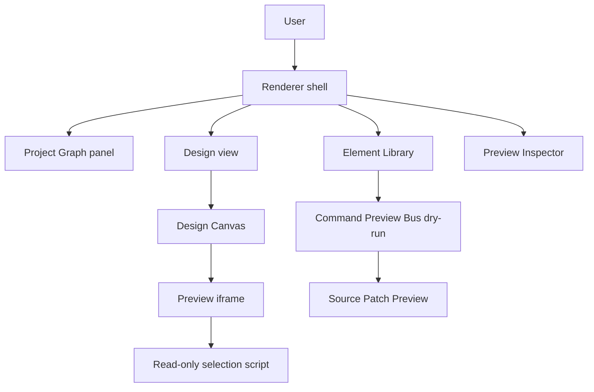

# System Overview

[Docs index](../README.md)

## Purpose

This document describes Crystal at product and system level. It explains what the current application does, what architectural surfaces exist, and which future capabilities are deliberately not implemented yet.

## Current implementation

Crystal is an Electron desktop application for real HTML projects. The current system is a read-only analysis and preview foundation with dry-run command planning. Implemented subsystems include Project Graph scanning, Project Preview serving, DOM Snapshot building, Preview Selection, Preview Inspector, Design Canvas navigation, Visual Selection Overlay, Element Library catalog and eligibility, Source Patch Preview, Command Preview Bus, and validation scripts.

## Key files

- `README.md`
- `docs/roadmap-implementation.md`
- `apps/desktop/electron/main/main.ts`
- `apps/desktop/electron/renderer/views/design/design.html`
- `apps/desktop/electron/renderer/components/html-element-library-panel/html-element-library-panel.ts`
- `packages/core/commands/command-preview-bus/command-preview-bus.preview.ts`
- `packages/core/source-patch/html-source-anchor.selectors.ts`

## Data flow

At runtime, the user opens a project folder or an HTML file. Electron main scans the selected root through Project Graph services and adapters. The renderer receives sanitized graph state through preload. The user can load a Preview target. Main resolves it to the active project root and serves it through `crystal-preview://current/<relative-path>`. DOM Snapshot reads the static HTML source of the resolved target. Preview Selection reports bounded selected-node metadata. Preview Inspector derives a read-only view from Preview, Selection, and DOM Snapshot state. Element Library generates dry-run command previews only when a target is safely matched.

## Boundaries

Implemented means the code path exists and is validated by current scripts. Future means the concept is planned but not executable. Blocked means the behavior is intentionally prevented for security or correctness. In this branch, documentation must not convert Future or Blocked features into implemented claims.

Blocked current capabilities include real insertion, real source mutation, source patch application, write IPC, undo/redo execution, attribute editing, text editing, live iframe DOM inspection, direct filesystem access from renderer, and Electron security relaxation.

## Validation

The current source validation entrypoints are declared in `package.json`: `build`, `typecheck`, feature validators, `validate:local`, and `validate:local:quick`. Documentation validation is handled by `scripts/validate-architecture-docs.mjs` on this branch.

## Related docs

- [Repository map](./repository-map.md)
- [Runtime boundaries](./runtime-boundaries.md)
- [Security model](./security-model.md)
- [Project open flow](./flows/project-open-flow.md)
- [Future write flow](./flows/future-write-flow.md)

## Future work

The next safe architectural step is Phase 6C: add transaction and refresh-boundary planning contracts while keeping source mutation unavailable. Later phases may add real writing only after command execution, patch application, persistence, undo/redo, dirty-state workflow, refresh invalidation, and validation gates exist.
