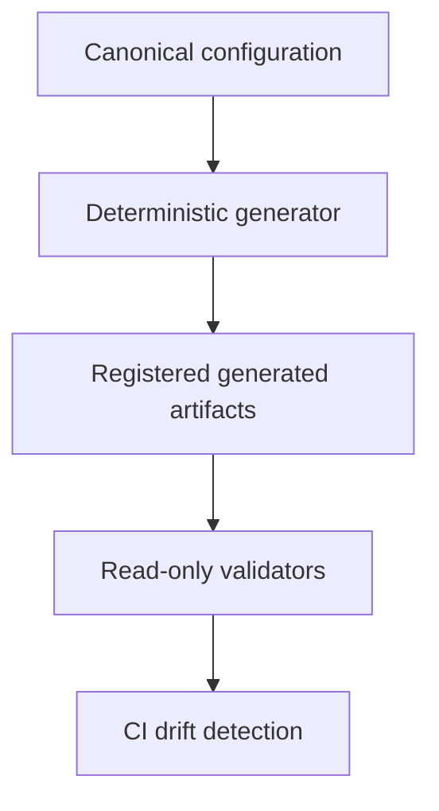

# Validation platform hardening phase 2

[Docs index](../README.md)

## Purpose

This phase hardened the tooling that generates metadata and reports validation. It changed how repository truth is synchronized and checked, not what the product can do.

## Architecture boundary

Canonical configuration flows through deterministic generation into registered artifacts, which read-only validators compare in local and CI environments. Product runtime behavior is outside this phase.

## Validator catalog ownership

Entries declare npm script, execution mode, arguments, suite membership, requirement level, and script ownership. `generated` scripts belong to the catalog; `external` scripts remain manually owned and are only verified.

## Current implementation

Canonical configuration and the validator catalog own derivable metadata. Build-time synchronization writes only registered outputs. Validation remains read-only. Process execution uses argument arrays, bounded resources, explicit failure types, and stable output modes. GitHub Actions uses read-only permissions and pinned allowlisted actions.

## Key files

- `config/project-baseline.json`
- `config/project-metadata-consumers.json`
- `scripts/sync-project-metadata.mjs`
- `scripts/validation/validation-suite.mjs`
- `scripts/validation/process-runner.mjs`
- `docs/metadata/validation-behavior-contracts.json`

## Transactional metadata synchronization

Synchronization acquires an exclusive lock, stages every target, rereads staged output, records backups and a journal, replaces targets, rolls all targets back on failure, and cleans transaction residue in `finally`. Atomicity is per file; cross-file consistency comes from rollback.

## Process execution contracts

The process runner uses `shell: false`, argument arrays, timeout and output limits, normalized duration, and explicit failure taxonomy. Diagnostic command formatting excludes credentials and does not become execution parsing.

## Canonical metadata consumers

`config/project-metadata-consumers.json` registers generated files, document blocks, runtime imports, and doctor checks. Validation checks ownership, field presence, paths, markers, duplicates, and independent hardcoded equivalents.

## Markdown navigation validation

Markdown integrity checks local links and fragments, reference links, simple HTML `href` values, encoded paths, duplicate-heading suffixes, fenced-code exclusions, and repository traversal. It does not access the network or claim complete CommonMark parsing.

## Change-policy base resolution

Pull-request CI uses the exact base SHA. Push CI uses `before`; an all-zero branch-creation value triggers the documented fallback. The validator reports branch and base provenance and fails closed when CI lacks authoritative comparison data.

## GitHub Actions security

Validation keeps `contents: read`, disables persisted checkout credentials, avoids `pull_request_target`, pins allowlisted actions to full SHAs, and does not upload the workspace or sensitive paths.

## Documentation ownership

Derivable values may be generated; explanatory prose remains human-authored. Editorial rules live in validation contracts, not generated paragraphs.

## Data flow

The generator parses strict schemas, calculates every registered output, stages changes, records backups and a journal, replaces targets, and rolls back if replacement fails. Validators compare canonical inputs and outputs without writing. CI supplies authoritative branch/base information to change policy and fails closed when it cannot resolve it.

## Boundaries

npm remains the dependency resolver. Tooling does not simulate arbitrary npm ranges or silently replace external scripts. Generated Markdown requires exactly one valid marker pair and preserves surrounding human prose.

## Validation

Run `npm run test:tooling-hardening`, metadata, validation-system, change-policy, Markdown-integrity, and local-quick checks. JSON output must remain parseable and result semantics must not depend on terminal decoration.

## Related docs

- [Validation system](./validation-system.md)
- [Validation flow](./flows/validation-flow.md)
- [Development](../development.md)

## Future work

Hardening should continue only where a concrete drift, ambiguity, or failure mode exists. Additional generators are not a goal by themselves.

## Read next

You are here: Validation Platform Hardening Phase 2.

Before this:
- [Validation System](./validation-system.md) defines result semantics and the current gate catalog.

Next:
- [Validation flow](./flows/validation-flow.md) follows a change through focused and aggregate checks.

Why this matters:
The phase prevents partial metadata writes, ambiguous process failures, hidden script ownership changes, broken navigation, and credential-bearing CI behavior without expanding product capability.
