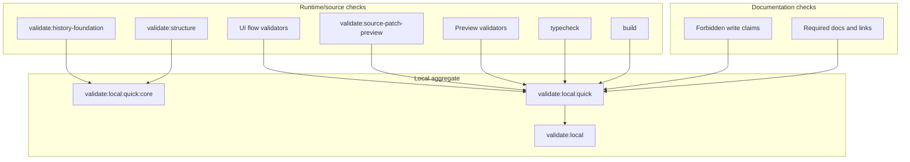

# Validation System

[Docs index](../README.md)

## At a glance

| Question | Answer |
| --- | --- |
| Is this implemented? | Yes, as script-based static and local validators. |
| Can validators patch files? | No. Validators read and fail; they do not mutate source. |
| Runtime owner | npm scripts and Node validators. |
| Phase 6C addition | `validate:history-foundation`. |
| Safety risk controlled | Prevents forbidden shortcuts and false write claims from entering unnoticed. |

## Purpose

Crystal has several features whose safest behavior is the absence of a shortcut: no renderer filesystem access, no live iframe DOM reads, no write IPC, no patch application, no real undo/redo, and no hidden Apply behavior. The validation system makes those negative guarantees visible while the codebase changes.

## Why this exists

A future visual editor can fail by doing too much too early. Validators keep blocked behavior blocked and keep documentation from overstating implementation status.

## How to read this page

| Need | Command or doc |
| --- | --- |
| Docs-only architecture check | `npm run validate:architecture-docs` |
| Phase 6C planning safety | `npm run validate:history-foundation` |
| Installed quick gate | `npm run validate:local:quick` |
| Full local gate | `npm run validate:local` |
| Preview safety | `npm run validate:preview` and related Preview validators. |
| Command preview safety | `npm run validate:source-patch-preview` |

## Current implementation

Validation is script-based and uses the existing Node toolchain. The root scripts cover build, typecheck, structure, Project Graph, watcher behavior, Preview, DOM Snapshot, Preview Selection, Preview Inspector, Design Canvas, Visual Selection Overlay, HTML Element Library, Source Patch Preview, History Foundation, UI flow, Electron diagnostics, and architecture docs.

| Implemented | Blocked | Future |
| --- | --- | --- |
| Feature validators. | Validators applying source changes. | Import-boundary checks. |
| Docs validator. | Docs claiming future writes. | Write runtime safety checks. |
| Local aggregate runners. | Hidden mutation during validation. | Transaction execution checks. |
| History foundation validator. | Phase 6C write behavior. | Dirty-state validation. |

## Key files

Read `package.json` first to see the command graph. The scripts below are the feature gates most relevant to architecture boundaries.

## Key files and responsibilities

| File | Responsibility | Reads | Must not do |
| --- | --- | --- | --- |
| `package.json` | Defines validation command graph. | Script names. | Add runtime dependencies for validation. |
| `scripts/validate-local.mjs` | Runs aggregate local validation. | npm commands. | Hide failing steps. |
| `scripts/validate-structure.mjs` | Checks source structure. | Source tree. | Rewrite modules. |
| `scripts/validate-source-patch-preview.mjs` | Guards preview/write boundary. | Source and renderer files. | Permit patch apply. |
| `scripts/validate-history-foundation.mjs` | Guards Phase 6C planning boundary. | History, refresh, transaction-planning, package scripts, docs. | Permit write execution. |
| `scripts/validate-ui-flow.mjs` | Guards shell UI flow assumptions. | Renderer source. | Change runtime behavior. |
| `scripts/validate-architecture-docs.mjs` | Checks docs shape and safety language. | Markdown docs. | Replace runtime validators. |

## Data flow

| Input | Decision | Output |
| --- | --- | --- |
| Source files | Do feature constraints still hold? | Pass or explicit failure. |
| Phase 6C modules | Are contracts present and still planning-only? | Pass or explicit failure. |
| Docs files | Are required maps, links, tables, diagrams, callouts, and safety phrases present? | Pass or explicit failure. |
| Aggregate local command | Did each gate pass in order? | Non-zero exit on failure. |



## Boundaries

A passing documentation validator does not prove a feature works. It only proves that the docs set still carries the required map and safety language. A passing feature validator does not grant permission to claim future behavior as implemented.

> **Implementation note:** Phase 6C validation proves the presence and safety of planning contracts; it does not prove execution because no execution path exists.

## What this does not do

| Not provided | Reason |
| --- | --- |
| Runtime proof for future writes | No write runtime exists. |
| Runtime proof for real undo/redo | No executed transaction log exists. |
| Auto-formatting | Validators should not mutate docs. |
| Complete import graph validation | Future work. |

## Common misunderstanding

> **Common misunderstanding:** Documentation validation, feature validation, and typecheck are complementary. One cannot replace the other.

## Validation

Run:

```bash
npm run validate:history-foundation
npm run validate:architecture-docs
npm run validate:local:quick
```

Use `validate:local` when the full install-backed path is needed.

## Related docs

- [Validation flow](./flows/validation-flow.md)
- [Validation gates diagram](./diagrams/validation-gates.md)
- [Repository map](./repository-map.md)
- [Future write flow](./flows/future-write-flow.md)
- [Roadmap implementation status](../roadmap-implementation.md)

## Future work

The next validation improvements should check import boundaries and docs-to-source path drift. Write-capable phases will need additional gates for command execution, patch application, transaction records, refresh invalidation, dirty state, and undo/redo reversibility.
