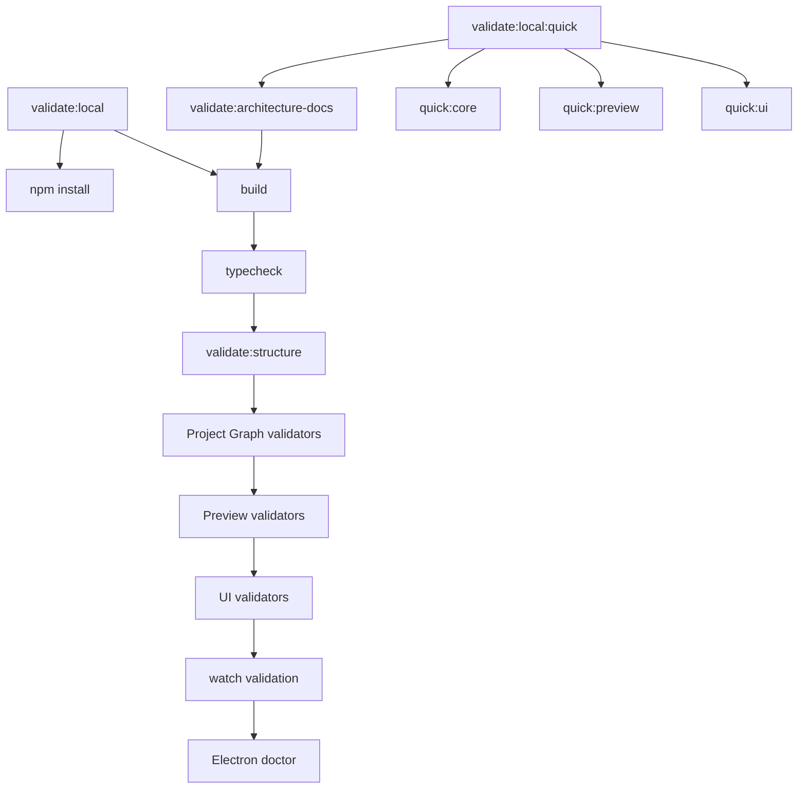

# Validation System

[Docs index](../README.md)

## Purpose

Crystal has several features whose safest behavior is the absence of a shortcut: no renderer filesystem access, no live iframe DOM reads, no write IPC, no patch application, no real undo/redo. The validation system exists to make those negative guarantees visible while the codebase changes.

## Current implementation

Validation is script-based and uses the existing Node toolchain. The root scripts cover build, typecheck, structure, Project Graph, watcher behavior, Preview, DOM Snapshot, Preview Selection, Preview Inspector, Design Canvas, Visual Selection Overlay, HTML Element Library, Source Patch Preview, UI flow, Electron diagnostics, and the architecture docs.

The diagram separates the full local gate from the quicker installed-workspace path. The docs validator is intentionally small: it checks documentation shape and safety claims, not runtime behavior.



## Key files

Read `package.json` first to see the command graph. The scripts below are the feature gates most relevant to architecture boundaries.

- `package.json`
- `scripts/validate-local.mjs`
- `scripts/validate-structure.mjs`
- `scripts/validate-project-graph.mjs`
- `scripts/validate-project-watch.mjs`
- `scripts/validate-preview.mjs`
- `scripts/validate-dom-snapshot.mjs`
- `scripts/validate-preview-selection.mjs`
- `scripts/validate-preview-inspector.mjs`
- `scripts/validate-design-canvas.mjs`
- `scripts/validate-visual-selection-overlay.mjs`
- `scripts/validate-html-element-library.mjs`
- `scripts/validate-source-patch-preview.mjs`
- `scripts/validate-ui-flow.mjs`
- `scripts/validate-architecture-docs.mjs`

## Data flow

Validators read source files, fixtures, and documentation, then fail with explicit messages when a required structure or boundary is missing. They do not patch files. Feature validators protect runtime assumptions; the docs validator protects onboarding structure, cross-links, Mermaid coverage, roadmap references, and explicit blocked-write language.

## Boundaries

A passing documentation validator does not prove a feature works. It only proves that the docs set still carries the required map and safety language. A passing feature validator does not grant permission to claim future behavior as implemented. Documentation and runtime validation have different jobs.

## Validation

Run:

```bash
npm run validate:architecture-docs
npm run validate:local:quick
```

Use `validate:local` when the full install-backed path is needed.

## Related docs

- [Validation flow](./flows/validation-flow.md)
- [Validation gates diagram](./diagrams/validation-gates.md)
- [Repository map](./repository-map.md)
- [Roadmap implementation status](../roadmap-implementation.md)

## Future work

The next validation improvements should check import boundaries and docs-to-source path drift. Write-capable phases will need additional gates for command execution, patch application, transaction records, refresh invalidation, and undo/redo reversibility.
