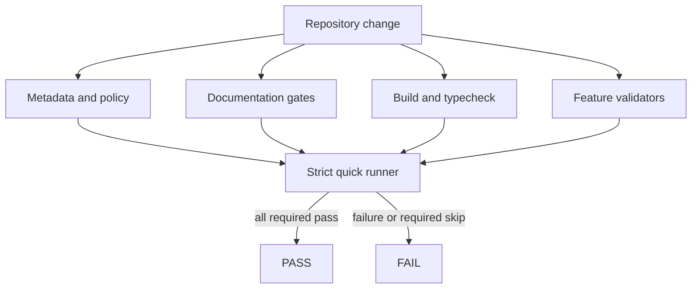

# Validation system

[Docs index](../README.md)

## At a glance

| Question | Answer |
| --- | --- |
| Canonical checks | 33 required checks in quick and full validation. |
| Result semantics | PASS, FAIL, and visible SKIPPED. |
| Mutation policy | Validators read and fail; they do not repair source. |
| Reporter modes | Human, plain, raw, and JSON summary without semantic drift. |
| Documentation role | Checks navigation, generated markers, links, and capability language. |

## Purpose

Many of Crystal’s most important guarantees are negative: renderer cannot reach the filesystem, Preview cannot become trusted source, planners cannot write, and read-only style surfaces cannot claim browser truth. Validators turn those boundaries into observable gates.

## Current implementation

The script graph covers generated metadata, change policy, Markdown integrity, guided docs, architecture docs, build outputs, typecheck, source ownership, project models, Preview, selection, Inspector, canvas, overlays, command previews, editing readiness, canonical source revision and freshness behavior, style inventory, authored matching, local watch, Electron diagnostics, and validation-system self-checks. The strict quick runner fails on required failures and required skips by default.

The source freshness validator compiles and executes the real portable core and Node adapter against temporary files outside the repository. It does not infer behavior from filenames or token searches alone.

## Generated validator catalog

<!-- crystal-generated:validation-catalog:start -->
<!-- Do not edit manually. Run npm run sync:project-metadata. -->

Canonical checks: 33. Local quick checks: 33. Full validation checks: 33.

| Group | ID | Label | npm script | Ownership | Required | Local quick | Full | Execution | Direct script | Args |
| --- | --- | --- | --- | --- | --- | --- | --- | --- | --- | --- |
| Validation foundation | `validation-system` | Validation System | `validate:validation-system` | generated | yes | yes | yes | direct-node | `scripts/validate-validation-system.mjs` | — |
| Generated metadata | `project-metadata` | Project Metadata | `validate:project-metadata` | generated | yes | yes | yes | direct-node | `scripts/sync-project-metadata.mjs` | `["--check"]` |
| Change policy | `change-policy` | Change Policy | `validate:change-policy` | generated | yes | yes | yes | direct-node | `scripts/validate-change-policy.mjs` | — |
| Documentation | `markdown-integrity` | Markdown Integrity | `validate:markdown-integrity` | generated | yes | yes | yes | direct-node | `scripts/validate-markdown-integrity.mjs` | — |
| Documentation | `guided-docs` | Guided docs | `validate:guided-docs` | generated | yes | yes | yes | direct-node | `scripts/validate-guided-docs.mjs` | — |
| Documentation | `architecture-docs` | Architecture docs | `validate:architecture-docs` | generated | yes | yes | yes | direct-node | `scripts/validate-architecture-docs.mjs` | — |
| Build | `build-html` | Build HTML | `build:html` | generated | yes | yes | yes | direct-node | `scripts/build-html.mjs` | — |
| Build | `build-scss` | Build SCSS | `build:scss` | generated | yes | yes | yes | direct-node | `scripts/build-scss.mjs` | — |
| Build | `build-ts` | Build TS | `build:ts` | generated | yes | yes | yes | direct-node | `scripts/build-ts.mjs` | — |
| Build | `typecheck` | Typecheck | `typecheck` | external | yes | yes | yes | npm | — | — |
| Core | `structure` | Structure | `validate:structure` | generated | yes | yes | yes | direct-node | `scripts/validate-structure.mjs` | — |
| Core | `source-tree-boundaries` | Source Tree Boundaries | `validate:source-tree-boundaries` | generated | yes | yes | yes | direct-node | `scripts/validate-source-tree-boundaries.mjs` | — |
| Core | `source-freshness-foundation` | Source Freshness Foundation | `validate:source-freshness-foundation` | generated | yes | yes | yes | direct-node | `scripts/validate-source-freshness-foundation.mjs` | — |
| Core | `project-graph` | Project Graph | `validate:project-graph` | generated | yes | yes | yes | direct-node | `scripts/validate-project-graph.mjs` | — |
| Core | `project-watch` | Project Watch | `validate:project-watch` | generated | yes | yes | yes | direct-node | `scripts/validate-project-watch.mjs` | — |
| Core | `history-foundation` | History Foundation | `validate:history-foundation` | generated | yes | yes | yes | direct-node | `scripts/validate-history-foundation.mjs` | — |
| Core | `design-editing-preflight` | Design Editing Preflight | `validate:design-editing-preflight` | generated | yes | yes | yes | direct-node | `scripts/validate-design-editing-preflight.mjs` | — |
| Core | `inspector-editing-foundation` | Inspector Editing Foundation | `validate:inspector-editing-foundation` | generated | yes | yes | yes | direct-node | `scripts/validate-inspector-editing-foundation.mjs` | — |
| Core | `style-engine-foundation` | Style Engine Foundation | `validate:style-engine-foundation` | generated | yes | yes | yes | direct-node | `scripts/validate-style-engine-foundation.mjs` | — |
| Core | `authored-style-matching` | Authored Style Matching | `validate:authored-style-matching` | generated | yes | yes | yes | direct-node | `scripts/validate-authored-style-matching.mjs` | — |
| Preview | `preview` | Preview | `validate:preview` | generated | yes | yes | yes | direct-node | `scripts/validate-preview.mjs` | — |
| Preview | `dom-snapshot` | DOM Snapshot | `validate:dom-snapshot` | generated | yes | yes | yes | direct-node | `scripts/validate-dom-snapshot.mjs` | — |
| Preview | `preview-selection` | Preview Selection | `validate:preview-selection` | generated | yes | yes | yes | direct-node | `scripts/validate-preview-selection.mjs` | — |
| Preview | `preview-inspector` | Preview Inspector | `validate:preview-inspector` | generated | yes | yes | yes | direct-node | `scripts/validate-preview-inspector.mjs` | — |
| UI | `design-canvas` | Design Canvas | `validate:design-canvas` | generated | yes | yes | yes | direct-node | `scripts/validate-design-canvas.mjs` | — |
| UI | `visual-selection-overlay` | Visual Selection Overlay | `validate:visual-selection-overlay` | generated | yes | yes | yes | direct-node | `scripts/validate-visual-selection-overlay.mjs` | — |
| UI | `html-element-library` | HTML Element Library | `validate:html-element-library` | generated | yes | yes | yes | direct-node | `scripts/validate-html-element-library.mjs` | — |
| UI | `source-patch-preview` | Source Patch Preview | `validate:source-patch-preview` | generated | yes | yes | yes | direct-node | `scripts/validate-source-patch-preview.mjs` | — |
| UI | `editable-inspector-surface` | Editable Inspector Surface | `validate:editable-inspector-surface` | generated | yes | yes | yes | direct-node | `scripts/validate-editable-inspector-surface.mjs` | — |
| UI | `css-sass-inspector-surface` | CSS/Sass Inspector Surface | `validate:css-sass-inspector-surface` | generated | yes | yes | yes | direct-node | `scripts/validate-css-sass-inspector-surface.mjs` | — |
| UI | `ui-flow` | UI Flow | `validate:ui-flow` | generated | yes | yes | yes | direct-node | `scripts/validate-ui-flow.mjs` | — |
| Environment | `local-watch` | Local Watch | `validate:local:watch` | generated | yes | yes | yes | direct-node | `scripts/validate-local-watch.mjs` | — |
| Environment | `electron-doctor` | Electron Doctor | `doctor:electron` | generated | yes | yes | yes | direct-node | `scripts/doctor-electron.mjs` | — |
<!-- crystal-generated:validation-catalog:end -->

## Key files

The following paths are the shortest reliable entry points. They are not a substitute for following the data flow through the subsystem.

## Key files and responsibilities

| File or path | Responsibility | Reads | Must not do |
| --- | --- | --- | --- |
| `package.json` | Public command graph. | script declarations | hide required checks |
| `scripts/validation/validation-suite.mjs` | Canonical suite metadata. | check descriptors | invent successful checks |
| `scripts/validation/validation-runner.mjs` | Executes checks and calculates status. | child-process results | convert failure to warning |
| `scripts/validation/validation-reporter.mjs` | Formats terminal, raw, and JSON output. | observed results | change status semantics |
| `scripts/validate-source-freshness-foundation.mjs` | Executes canonical byte-revision, path-containment, failure-state, and conflict-preview fixtures. | temporary files and compiled foundation modules | write repository source or claim Apply authority |
| `scripts/validate-validation-system.mjs` | Meta-validates validation wiring. | scripts, metadata, and docs | recursively run the quick suite |

## Data flow

| Input | Decision | Output |
| --- | --- | --- |
| Required check | Does its command or direct script resolve? | Execution or explicit failure |
| Child process | What exit status and output were observed? | PASS, FAIL, or SKIPPED |
| Render mode | Where is output going? | Different presentation, same result |
| Aggregate suite | Did every required check execute and pass? | Zero or non-zero process exit |
| Generated metadata | Does checked content match canonical inputs? | Stable output or drift failure |

## Boundaries

A passing documentation gate does not prove runtime behavior. A passing feature gate does not make a planned capability real. Validators must not mutate repository files, conceal skipped checks, or print language suggesting they repaired source. Behavioral validators may create isolated temporary fixtures outside the repository and must remove them even when a check fails.

> **Safety boundary:** State that crosses a boundary is evidence to validate, not authority to perform a privileged effect.

## What this does not do

| Not provided | Why |
| --- | --- |
| Autofix | Validation reports drift; generation is a separate explicit operation. |
| Future capability proof | Checks preserve boundaries but do not implement features. |
| Write-runtime conflict gate | The freshness validator proves read-only primitives, not writer-time invocation. |
| Import graph completeness | Physical ownership is covered; full dependency linting remains future. |
| Merge decision | Review and CI remain separate evidence. |

## Common misunderstanding

> **Common misunderstanding:** A validator is evidence only for the contract it actually executed. Passing the source freshness validator proves canonical read-only revision behavior; it does not prove a nonexistent writer will recheck before mutation.

## Canonical phase boundary statements

The repository validators preserve the following historical phase contracts verbatim. They describe the scope of each increment when it landed; they do not erase later read-only additions.

- Phase 6D remained preflight-only.
- Phase 7A was the Editable Inspector draft/intent foundation.
- Phase 7B added the Editable Inspector read-only draft surface.
- Phase 8A introduced the Style Engine read-only source inventory foundation. No CSS/Sass Inspector visual surface is added within that phase.

Across those boundaries: No real cascade is calculated. No computed styles are read. No style editing is implemented. No source files are written. No patch apply is available. No write IPC exists. Apply remains unavailable. No contenteditable is used. No undo/redo execution runs. Dirty-state is not persisted. No refresh execution runs. No Preview DOM mutation occurs.

## Canonical Phase 8B boundary

Phase 8B — CSS/Sass Inspector read-only visual surface

Phase 8B boundary: CSS/Sass Inspector read-only visual surface only. No real cascade is calculated. No computed styles are read. No style editing is implemented. No source files are written. No patch apply is available. No write IPC exists. Apply remains unavailable. No contenteditable is used. No undo/redo execution runs. Dirty-state is not persisted. No refresh execution runs. No Preview DOM mutation occurs.

The phase also excludes real cascade calculation, computed style inspection, style editing, CSS/Sass source writes, Sass compilation, Sass import resolution, patch apply, IPC write, save/apply workflow, real undo/redo execution, dirty-state persistence, refresh execution, DOM mutation, and Apply enablement.

## Canonical Phase 8C boundary

Phase 8C — Authored Style Matching over DOM Snapshot

Phase 8C boundary: Authored Style Matching over DOM Snapshot only. No real cascade is calculated. No computed styles are read. No document.styleSheets or CSSOM is used. No iframe internals are read. No live Preview DOM matching is performed. No source files are written. No patch apply is available. No write IPC exists. Apply remains unavailable. No contenteditable is used. No undo/redo execution runs. Dirty-state is not persisted. No refresh execution runs. No Preview DOM mutation occurs.

## Validation

Run `npm run validate:source-freshness-foundation` for the focused behavioral foundation, `npm run validate:validation-system` to check the validator platform itself, `npm run validate:local:quick` for the canonical strict local suite, and `npm --silent run validate:local:quick:json` for parseable summary output.

## Related docs

- [Validation platform hardening](./validation-platform-hardening-phase-2.md)
- [Validation flow](./flows/validation-flow.md)
- [Validation gates diagram](./diagrams/validation-gates.md)
- [Development](../development.md)

## Future work

Add the execution-time write-runtime conflict gate only when a real writer exists. New checks must remain deterministic, required where appropriate, and honest about missing execution.

## Read next

You are here: Validation System.

Before this:
- [Architecture overview](./README.md) explains which boundaries validation protects.

Next:
- [Future write flow](./flows/future-write-flow.md) places read-only source revision evidence before the future mutation boundary.
- [Authored Style Matching over DOM Snapshot](./authored-style-matching-dom-snapshot.md) is another concrete example of a narrowly guarded read-only capability.
- [Validation platform hardening](./validation-platform-hardening-phase-2.md) explains metadata generation, process execution, and CI constraints.

Why this matters:
Validation is the evidence layer that keeps documentation, code, generated metadata, and negative guarantees synchronized without pretending that unexecuted work passed.
