# Validation System

[Docs index](../README.md)

> **Navigation:** [Start here](../README.md) → [Guided reading](../guided-reading.md) → [Architecture overview](./README.md) → Validation System → [Authored Style Matching over DOM Snapshot](./authored-style-matching-dom-snapshot.md)

## At a glance

| Question | Answer |
| --- | --- |
| Is this implemented? | Yes, as script-based static and local validators. |
| Can validators patch files? | No. Validators read and fail; they do not mutate source. |
| Runtime owner | npm scripts and Node validators. |
| Current quick suite size | 28 required checks. |
| Phase 6C addition | `validate:history-foundation`. |
| Phase 6D addition | `validate:design-editing-preflight`. |
| Phase 7A addition | `validate:inspector-editing-foundation`. |
| Phase 7B addition | `validate:editable-inspector-surface`. |
| Phase 8A addition | `validate:style-engine-foundation`. |
| Phase 8B addition | `validate:css-sass-inspector-surface`. |
| Phase 8C addition | `validate:authored-style-matching`. |
| Guided docs addition | `validate:guided-docs`. |
| Strict reporter addition | `validate:local:quick` now runs through `scripts/validate-local-quick.mjs`. |
| Meta validation addition | `validate:validation-system` validates the validation runner, reporter, suite metadata, render modes, failure types, and static wiring. |
| Safety risk controlled | Prevents forbidden shortcuts and false write/edit/cascade claims from entering unnoticed. |

## Purpose

Crystal uses validators to preserve negative guarantees: no renderer filesystem access, no live iframe DOM reads, no browser CSSOM shortcut, no computed style reads, no write IPC, no patch application, no real undo/redo execution, no dirty-state persistence, no refresh execution, no contenteditable path, no hidden Apply behavior, and no source mutation.

The validation system makes feature phase boundaries explicit while the codebase evolves from read-only Preview and planning models toward later write-capable systems.

## Strict validation reporting contract

Validators must report only observed facts. They must not claim a fix was applied, must not hide skipped checks, and must not convert missing checks into PASS. A validation pass means every required check executed and passed.

PASS means executed and verified.

FAIL means at least one required check failed.

SKIPPED means a check did not run and must be visible in the final summary.

`validate:local:quick` must return a non-zero exit code when any required validator fails. It must also return a non-zero exit code when any check is SKIPPED unless the caller passes `--allow-skips`. The default mode is strict: missing npm scripts, unreadable required files, unresolved required checks, and failed child commands are failures, not successful validation.

Validators must not modify files, implement autofix behavior, or print wording that implies the script fixed, resolved, or corrected source. They may print how to inspect and likely resolution hints, but those hints are instructions for the developer, not actions performed by validation.

## Strict terminal reporter modes

`validate:local:quick` supports output modes without changing validation semantics or exit codes.

| Mode | Intended target | Behavior |
| --- | --- | --- |
| `auto` | Default local usage. | Uses unicode rich output with live progress and ANSI color on interactive TTY when allowed, and plain/ascii compact output without live progress or ANSI on CI, non-TTY, redirected output, `TERM=dumb`, or `NO_COLOR`. |
| `unicode` | Human terminal. | Forces unicode boxes, symbols, progress bars, tables, trees, and failure panels. Live progress still requires TTY; ANSI color is decorative and only enabled when allowed. |
| `ascii` / `plain` | Conservative terminal or logs. | Uses `OK`, `X`, `-`, `>`, ASCII separators, and ASCII progress bars. These modes never emit ANSI color. |
| `raw` | Stable parsing. | Prints one event per line: `VALIDATION_START`, `VALIDATION_STEP`, and `VALIDATION_RESULT`. No boxes, bars, unicode, ANSI color, or PASS stdout/stderr unless `--verbose`. |
| `json-summary` | Machine parsing. | Prints only valid JSON with suite status, counts, duration, performance data, and result rows. It never emits ANSI color or terminal decoration. |

Flags are presentation-only unless otherwise stated: `--unicode`, `--ascii`, `--plain`, `--raw`, `--json-summary`, `--color`, `--no-color`, `--no-progress`, `--compact`, `--verbose`, `--fail-fast`, and `--allow-skips`.

`--no-progress` disables live progress even in TTY. `--color` requests ANSI color when the selected render mode allows it. `--no-color` disables ANSI color always. `NO_COLOR` also disables ANSI by default. `--plain`, `--ascii`, `--raw`, and `--json-summary` take priority over color and remain copyable/parseable. Color is decorative: PASS, FAIL, SKIPPED, icons, labels, rankings, durations, and failure sections remain readable without color. `--compact` keeps failures complete but suppresses non-essential successful output. `--verbose` may print captured stdout/stderr and the internal `Executed:` command. `--raw` and `--json-summary` exist for stable CI/no-TTY consumption.

`--json-summary` makes the validation runner emit JSON only. For strictly parseable JSON, call `node scripts/validate-local-quick.mjs --json-summary`, `npm --silent run validate:local:quick -- --json-summary`, or `npm --silent run validate:local:quick:json`. Plain `npm run validate:local:quick -- --json-summary` can include npm lifecycle banner lines before the runner starts; those banner lines are outside the runner's control and are not JSON.

## Strict validation meta hardening

`validate:validation-system` is a static meta-validator for the validation system itself. It does not execute `validate:local:quick` and does not create a recursion cycle.

It verifies that quick-suite checks have unique ids, labels, known categories, required status, public `npmScript` contracts, matching `displayCommand` values, no direct `npm.cmd`, and no ambiguous shell execution. It also verifies that direct Node scripts exist, that declared npm scripts exist in `package.json`, that failure types include `none`, `command-execution`, `missing-npm-script`, `missing-direct-script`, `validator-failure`, and `skipped`, that ANSI rendering is dependency-free, that `stripAnsi`/visible-length helpers keep alignment stable, that `--color`/`--no-color`/`NO_COLOR` are wired, that `validate:local:quick:json` exists for silent npm JSON consumption, that `npm --silent` and direct Node JSON invocations are documented, and that critical validators use the shared assertions path that reports `checksExecuted` and fails when `checksExecuted === 0`.

The meta-validator must print `Files checked`, `Checks executed`, and `Result`, and it must fail rather than warn when static validation-system wiring is broken.

## Current implementation

Validation is script-based and uses the existing Node toolchain. The root scripts cover build, typecheck, structure, Project Graph, watcher behavior, Preview, DOM Snapshot, Preview Selection, Preview Inspector, Design Canvas, Visual Selection Overlay, HTML Element Library, Source Patch Preview, History Foundation, Design Editing Preflight, Inspector Editing Foundation, Editable Inspector Surface, Style Engine Foundation, CSS/Sass Inspector Surface, Authored Style Matching, Guided Docs, UI flow, Electron diagnostics, architecture docs, and validation-system meta checks.

Phase 6C models are planning-only.

Phase 7A boundary: Editable Inspector draft/intent foundation only. No source files are written. No patch apply is available. No write IPC exists. Apply remains unavailable. No contenteditable is used. No undo/redo execution runs. Dirty-state is not persisted. No refresh execution runs. No Preview DOM mutation occurs.

Phase 7B boundary: Editable Inspector read-only draft surface only. No source files are written. No patch apply is available. No write IPC exists. Apply remains unavailable. No contenteditable is used. No undo/redo execution runs. Dirty-state is not persisted. No refresh execution runs. No Preview DOM mutation occurs.

Phase 8A boundary: Style Engine read-only source inventory foundation only. No CSS/Sass Inspector visual surface is added. No real cascade is calculated. No computed styles are read. No style editing is implemented. No source files are written. No patch apply is available. No write IPC exists. Apply remains unavailable. No contenteditable is used. No undo/redo execution runs. Dirty-state is not persisted. No refresh execution runs. No Preview DOM mutation occurs.

Phase 8B — CSS/Sass Inspector read-only visual surface

Phase 8B boundary: CSS/Sass Inspector read-only visual surface only. No real cascade is calculated. No computed styles are read. No style editing is implemented. No source files are written. No patch apply is available. No write IPC exists. Apply remains unavailable. No contenteditable is used. No undo/redo execution runs. Dirty-state is not persisted. No refresh execution runs. No Preview DOM mutation occurs.

Phase 8C — Authored Style Matching over DOM Snapshot

Phase 8C boundary: Authored Style Matching over DOM Snapshot only. No real cascade is calculated. No computed styles are read. No document.styleSheets or CSSOM is used. No iframe internals are read. No live Preview DOM matching is performed. No source files are written. No patch apply is available. No write IPC exists. Apply remains unavailable. No contenteditable is used. No undo/redo execution runs. Dirty-state is not persisted. No refresh execution runs. No Preview DOM mutation occurs.

| Implemented | Blocked | Future |
| --- | --- | --- |
| Feature validators. | Validators applying source changes. | Import-boundary checks. |
| Docs validator. | Docs claiming future writes. | Write runtime safety checks. |
| Guided docs validator. | Broken read-next navigation. | Generated docs site navigation. |
| Local aggregate runners. | Hidden mutation during validation. | Transaction execution checks. |
| Strict local quick reporter. | Hidden skipped checks. | Machine-readable validation reports. |
| Validation system meta-validator. | Validation-system self-checks silently drifting. | Deeper import-boundary validation. |
| Terminal render modes. | CI logs polluted by live progress. | Optional report file export. |
| History foundation validator. | Phase 6C write behavior. | Dirty-state validation. |
| Design editing preflight validator. | Phase 6D Apply enablement. | Write-runtime validation. |
| Inspector editing foundation validator. | Phase 7A applied Inspector editing. | Inspector Apply validation. |
| Editable Inspector surface validator. | Phase 7B enabled editing controls. | Write-capable Inspector validation. |
| Style Engine foundation validator. | Phase 8A style editing, real cascade, computed style reads, and iframe internals. | Authored/computed style correlation. |
| CSS/Sass Inspector surface validator. | Phase 8B cascade, computed styles, style editing, writes, and Apply. | CSS/Sass editing validation. |
| Authored Style Matching validator. | Phase 8C CSSOM, computed style reads, live DOM matching, writes, and Apply. | Complex selector engine and cascade validation. |

## Key files

Read `package.json` first to see the command graph. The scripts below are the feature gates most relevant to architecture boundaries.

## Key files and responsibilities

| File | Responsibility | Reads | Must not do |
| --- | --- | --- | --- |
| `package.json` | Defines validation command graph. | Script names. | Add runtime dependencies for validation. |
| `scripts/validate-local.mjs` | Runs aggregate local validation. | npm commands. | Hide failing steps. |
| `scripts/validate-local-quick.mjs` | Runs strict granular quick validation with render modes, progress, captured output, summary, performance reporting, and explicit skipped handling. | Validation suite metadata and runner flags. | Hide failures, skip silently, or stop before summary. |
| `scripts/validate-validation-system.mjs` | Runs static meta-validation for the validation system itself. | Suite metadata, package scripts, validation modules, docs. | Execute `validate:local:quick`, mutate files, or create recursion. |
| `scripts/validation/validation-suite.mjs` | Lists required quick checks with labels, categories, public npm scripts, direct Node execution metadata, and required status. | Static check list. | Invent passing checks for missing scripts. |
| `scripts/validation/validation-runner.mjs` | Executes checks sequentially and calculates PASS/FAIL/SKIPPED. | Child process status, stdout, stderr, package scripts, direct script existence. | Convert failed commands into warnings or exit zero on FAIL/SKIPPED. |
| `scripts/validation/validation-reporter.mjs` | Formats render-mode-aware per-check output, raw events, JSON summary, failure detail, performance data, and final summary. | Validation results and terminal capabilities. | Claim fixes or omit skipped checks. |
| `scripts/validation/validation-terminal-components.mjs` | Centralizes terminal UI primitives: boxes, tables, trees, progress bars, duration bars, status markers, ANSI color, ANSI stripping, visible-length padding, wrapping, and truncation. | Pure inputs. | Change validation results. |
| `scripts/validation/validation-terminal-capabilities.mjs` | Detects TTY, CI, TERM, width, unicode capability, `NO_COLOR`, and default ANSI color capability. | Environment and stdout metadata. | Execute validators. |
| `scripts/validation/validation-render-mode.mjs` | Resolves `auto`, `unicode`, `ascii`, `plain`, `raw`, `json-summary`, and whether ANSI color is allowed. | Flags and terminal capabilities. | Change exit codes. |
| `scripts/validation/validation-performance.mjs` | Summarizes duration, slowest checks, execution modes, process launches, and duplicate execution warnings. | Validation results. | Fail performance thresholds in this phase. |
| `scripts/validation/validation-meta.mjs` | Implements static hardening checks for validation suite and reporter wiring. | Package scripts, suite, runner, reporter, docs, critical validators. | Execute the local quick runner. |
| `scripts/validation/validation-assertions.mjs` | Provides deterministic file, token, package script, and forbidden-token assertions. | Source files and package.json. | Mutate source files. |
| `scripts/validate-structure.mjs` | Checks source structure. | Source tree. | Rewrite modules. |
| `scripts/validate-source-patch-preview.mjs` | Guards preview/write boundary. | Source and renderer files. | Permit patch apply. |
| `scripts/validate-history-foundation.mjs` | Guards Phase 6C planning boundary. | History, refresh, transaction-planning, package scripts, docs. | Permit write execution. |
| `scripts/validate-design-editing-preflight.mjs` | Guards Phase 6D readiness boundary. | Dirty-state, source-conflict, write-runtime, design-editing, package scripts, docs. | Permit Apply enablement. |
| `scripts/validate-inspector-editing-foundation.mjs` | Guards Phase 7A Inspector draft/intent boundary. | Inspector editing contracts, package scripts, docs, runtime UI source. | Permit applied Inspector editing. |
| `scripts/validate-editable-inspector-surface.mjs` | Guards Phase 7B disabled/read-only surface boundary. | Editable Inspector renderer, core view model, package scripts, docs. | Permit enabled editing, Apply, write IPC, contenteditable, refresh execution, or DOM mutation. |
| `scripts/validate-style-engine-foundation.mjs` | Guards Phase 8A Style Engine source inventory boundary. | Style Engine contracts, package scripts, docs, and runtime wiring that mentions Style Engine. | Permit CSS/Sass editing, real cascade, computed style reads, iframe internals, writes, patch apply, write IPC, Apply, contenteditable, refresh, dirty persistence, undo/redo execution, or DOM mutation. |
| `scripts/validate-css-sass-inspector-surface.mjs` | Guards Phase 8B read-only visual surface boundary. | CSS/Sass Inspector renderer files, Preview panel integration, package scripts, and docs. | Permit cascade, computed style reads, browser CSSOM, iframe internals, editable controls, Apply buttons, write IPC, filesystem writes, or Preview DOM mutation. |
| `scripts/validate-authored-style-matching.mjs` | Guards Phase 8C DOM Snapshot authored candidate matching boundary. | Authored matching contracts, CSS/Sass Inspector candidate surface, package scripts, validation suite, and docs. | Permit CSSOM, computed style reads, live Preview DOM matching, iframe internals, writes, patch apply, write IPC, Apply, contenteditable, selector-engine shortcuts, or DOM mutation. |
| `scripts/validate-guided-docs.mjs` | Guards guided reading entrypoints and read-next navigation. | Markdown docs, package scripts, branch-aware git diff metadata. | Treat runtime feature branches as docs-only passes. |
| `scripts/validate-architecture-docs.mjs` | Checks docs shape and safety language. | Markdown docs. | Replace runtime validators. |

## Data flow

| Input | Decision | Output |
| --- | --- | --- |
| Source files | Do feature constraints still hold? | Pass or explicit failure. |
| Required quick check | Does the npm script exist and execute? | PASS, FAIL, or visible SKIPPED. |
| Missing required script | Is the check required? | FAIL. |
| Missing direct Node script | Does the direct execution target exist? | FAIL. |
| Optional skipped check | Was it explicitly optional? | SKIPPED in final summary. |
| Render mode | Is the destination human TTY, CI/no-TTY, raw, or JSON? | Presentation changes only; result and exit code do not change. |
| Performance summary | Which checks took longest and which execution modes launched processes? | Informational report only. |
| Validation meta check | Is the validation system internally consistent? | Pass or explicit failure. |
| Phase 6C modules | Are contracts present and still planning-only? | Pass or explicit failure. |
| Phase 6D modules | Are preflight contracts present and still Apply-blocked? | Pass or explicit failure. |
| Phase 7A modules | Are Inspector editing contracts present and still draft/intent-only? | Pass or explicit failure. |
| Phase 7B renderer integration | Are controls disabled/read-only with no Apply handler? | Pass or explicit failure. |
| Phase 8A Style Engine modules | Are source inventory contracts present with no style editing, real cascade, computed style reads, iframe internals, or writes? | Pass or explicit failure. |
| Phase 8B CSS/Sass Inspector surface | Is the visual surface passive, read-only, and disconnected from CSSOM, iframe DOM, computed styles, cascade, Apply, and writes? | Pass or explicit failure. |
| Phase 8C Authored Style Matching | Are authored candidates matched from DOM Snapshot only with CSSOM, computed styles, live DOM, iframe internals, writes, and Apply blocked? | Pass or explicit failure. |
| Guided docs | Do entrypoints, read-next blocks, and internal links still form a path? | Pass or explicit failure. |
| Aggregate local command | Did each gate pass in order? | Non-zero exit on failure. |

```mermaid
flowchart TD
  subgraph Docs[Documentation checks]
    Guided[Guided reading navigation]
    DocsShape[Required docs and links]
    Claims[Forbidden write/edit claims]
  end

  subgraph Runtime[Runtime/source checks]
    Build[build]
    Typecheck[typecheck]
    Structure[validate:structure]
    SourcePatch[validate:source-patch-preview]
    History[validate:history-foundation]
    DesignEditing[validate:design-editing-preflight]
    InspectorEditing[validate:inspector-editing-foundation]
    EditableSurface[validate:editable-inspector-surface]
    StyleEngine[validate:style-engine-foundation]
    AuthoredMatching[validate:authored-style-matching]
    CSSSassSurface[validate:css-sass-inspector-surface]
    UI[UI flow validators]
  end

  subgraph StrictReporter[Strict local quick reporter]
    Meta[validate:validation-system]
    Suite[validation-suite]
    Runner[validation-runner]
    RenderMode[validation-render-mode]
    TerminalUI[validation-terminal-components]
    Reporter[validation-reporter]
    Performance[validation-performance]
    Summary[final summary]
  end

  subgraph Aggregate[Local aggregate]
    QuickCore[validate:local:quick:core]
    QuickUI[validate:local:quick:ui]
    Quick[validate:local:quick]
  end

  Guided --> DocsShape
  DocsShape --> Quick
  Claims --> Quick
  Meta --> Quick
  Structure --> QuickCore
  History --> QuickCore
  DesignEditing --> QuickCore
  InspectorEditing --> QuickCore
  StyleEngine --> QuickCore
  AuthoredMatching --> QuickCore
  EditableSurface --> QuickUI
  CSSSassSurface --> QuickUI
  SourcePatch --> QuickUI
  UI --> QuickUI
  Build --> Quick
  Typecheck --> Quick
  Suite --> Runner
  Runner --> RenderMode
  RenderMode --> TerminalUI
  Runner --> Reporter
  Reporter --> Performance
  Reporter --> Summary
  QuickCore --> Quick
  QuickUI --> Quick
```



## Boundaries

A passing documentation validator does not prove a feature works. It only proves that the docs set still carries the required map and safety language. A passing feature validator does not grant permission to claim future behavior as implemented.

Still out of scope for Phase 8B:

- real cascade calculation
- computed style inspection
- style editing
- CSS/Sass source writes
- Sass compilation
- Sass import resolution
- patch apply
- IPC write
- save/apply workflow
- real undo/redo execution
- dirty-state persistence
- refresh execution
- DOM mutation
- Apply enablement

Still out of scope for Phase 8C:

- real cascade calculation
- computed style inspection
- CSSOM
- live Preview DOM matching
- selector engine for complex selectors
- Sass nesting resolution
- media/supports/container evaluation
- style editing
- class management
- source writes
- patch apply
- write IPC
- save/apply workflow
- undo/redo execution
- dirty-state persistence
- refresh execution
- DOM mutation
- Apply enablement

> **Implementation note:** Phase 8B validation proves the presence and safety of the CSS/Sass Inspector read-only visual surface; it does not prove Cascade Map behavior, computed style inspection, CSS/Sass source writes, Sass compilation, Sass import resolution, patch apply, write IPC, save/apply workflow, refresh execution, dirty-state persistence, or undo/redo execution.

> **Implementation note:** Phase 8C validation proves the presence and safety of DOM Snapshot-only authored candidate matching contracts and CSS/Sass Inspector candidate display; it does not prove real cascade behavior, computed style inspection, browser CSSOM access, live Preview DOM matching, CSS/Sass source writes, complex selector support, patch apply, write IPC, save/apply workflow, refresh execution, dirty-state persistence, or undo/redo execution.

## What this does not do

| Not provided | Reason |
| --- | --- |
| Runtime proof for future writes | No write runtime exists. |
| Runtime proof for real undo/redo | No executed transaction log exists. |
| Runtime proof for dirty-state persistence | No dirty-state store exists. |
| Runtime proof for applied Inspector edits | Phase 7A defines draft and intent previews; Phase 7B renders them disabled. |
| Runtime proof for real cascade | Phase 8C does not calculate cascade. |
| Runtime proof for computed styles | Phase 8C forbids computed style reads. |
| Runtime proof for style editing | Phase 8C keeps Apply unavailable and source writes unavailable. |
| Runtime proof for live DOM style matching | Phase 8C matches authored candidates from DOM Snapshot data only. |
| Performance gating | Performance is reported, not enforced, in this phase. |
| Auto-formatting | Validators should not mutate docs. |
| Auto-fixes | Validation reports likely resolution only; it does not apply changes. |
| Complete import graph validation | Future work. |

## Common misunderstanding

> **Common misunderstanding:** `validate:css-sass-inspector-surface` means the CSS/Sass Inspector visual surface is present and read-only. It does not mean style editing exists, does not mean CSS/Sass sources can be written, and does not mean computed styles or real cascade are available.

> **Common misunderstanding:** `validate:authored-style-matching` means DOM Snapshot-only authored candidate contracts and surface wiring are present and guarded. It does not mean browser-applied styles, real cascade, computed styles, CSSOM, live DOM matching, source writes, or Apply exist.

> **Common misunderstanding:** `validate:local:quick` is not a chain that stops at the first failed npm command by default. It runs the strict suite, records each required check, prints the failure output, and still emits a final summary unless `--fail-fast` is passed.

> **Common misunderstanding:** `--raw`, `--plain`, `--unicode`, and `--json-summary` change output only. They do not change what PASS, FAIL, or SKIPPED mean.

## Validation

Run:

```bash
npm run validate:validation-system
npm run validate:guided-docs
npm run validate:history-foundation
npm run validate:design-editing-preflight
npm run validate:inspector-editing-foundation
npm run validate:editable-inspector-surface
npm run validate:style-engine-foundation
npm run validate:authored-style-matching
npm run validate:css-sass-inspector-surface
npm run validate:architecture-docs
npm run validate:local:quick
npm run validate:local:quick -- --plain
npm run validate:local:quick -- --raw
node scripts/validate-local-quick.mjs --json-summary
npm --silent run validate:local:quick -- --json-summary
npm --silent run validate:local:quick:json
npm run validate:local:quick -- --json-summary
npm run validate:local:quick -- --no-progress
npm run validate:local:quick -- --compact
npm run validate:local:quick:verbose
npm run validate:local:quick:fail-fast
```

Use `validate:local` when the full install-backed path is needed.

## Related docs

- [Guided reading](../guided-reading.md)
- [Authored Style Matching over DOM Snapshot](./authored-style-matching-dom-snapshot.md)
- [CSS/Sass Inspector read-only visual surface](./css-sass-inspector-readonly-surface.md)
- [Validation flow](./flows/validation-flow.md)
- [Validation gates diagram](./diagrams/validation-gates.md)
- [Repository map](./repository-map.md)
- [Future write flow](./flows/future-write-flow.md)
- [Roadmap implementation status](../roadmap-implementation.md)

## Future work

The next validation improvements should check import boundaries and docs-to-source path drift. Write-capable phases will need additional gates for command execution, patch application, transaction records, refresh invalidation, dirty state, conflict detection, Inspector Apply UX, CSS/Sass style editing, authored/computed style correlation, and undo/redo reversibility.

## Read next

You are here: Validation System.

Before this:
- [Future write flow](./flows/future-write-flow.md) explains the blocked capabilities that validators must preserve.

Next:
- [Authored Style Matching over DOM Snapshot](./authored-style-matching-dom-snapshot.md) documents the Phase 8C boundary.

Related:
- [Guided reading](../guided-reading.md)
- [Validation flow](./flows/validation-flow.md)
- [Validation gates diagram](./diagrams/validation-gates.md)
- Validator: [`validate:guided-docs`](../../scripts/validate-guided-docs.mjs)
- Validator: [`validate:architecture-docs`](../../scripts/validate-architecture-docs.mjs)
- Validator: [`validate:css-sass-inspector-surface`](../../scripts/validate-css-sass-inspector-surface.mjs)
- Validator: [`validate:authored-style-matching`](../../scripts/validate-authored-style-matching.mjs)
- Validator: [`validate:validation-system`](../../scripts/validate-validation-system.mjs)
- Strict runner: [`validate:local:quick`](../../scripts/validate-local-quick.mjs)

Why this matters:
Validation is the enforcement layer for the documentation story. It keeps read-only Preview, dry-run commands, disabled Inspector surfaces, Style Engine inventory, CSS/Sass Inspector read-only UI, authored matching over DOM Snapshot, strict reporter output, meta-validation, and future write language from collapsing into unsupported implementation claims.