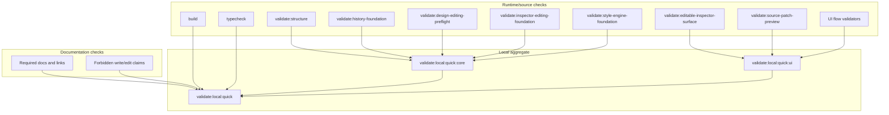

# Validation System

[Docs index](../README.md)

## At a glance

| Question | Answer |
| --- | --- |
| Is this implemented? | Yes, as script-based static and local validators. |
| Can validators patch files? | No. Validators read and fail; they do not mutate source. |
| Runtime owner | npm scripts and Node validators. |
| Phase 6C addition | `validate:history-foundation`. |
| Phase 6D addition | `validate:design-editing-preflight`. |
| Phase 7A addition | `validate:inspector-editing-foundation`. |
| Phase 7B addition | `validate:editable-inspector-surface`. |
| Phase 8A addition | `validate:style-engine-foundation`. |
| Safety risk controlled | Prevents forbidden shortcuts and false write/edit/cascade claims from entering unnoticed. |

## Purpose

Crystal has several features whose safest behavior is the absence of a shortcut: no renderer filesystem access, no live iframe DOM reads, no write IPC, no patch application, no real undo/redo, no dirty-state persistence, no refresh execution, no contenteditable path, no hidden Apply behavior, no enabled editing handler behind disabled Inspector affordances, and no Style Engine path that reads computed styles or calculates real cascade in Phase 8A. The validation system makes those negative guarantees visible while the codebase changes.

## Current implementation

Validation is script-based and uses the existing Node toolchain. The root scripts cover build, typecheck, structure, Project Graph, watcher behavior, Preview, DOM Snapshot, Preview Selection, Preview Inspector, Design Canvas, Visual Selection Overlay, HTML Element Library, Source Patch Preview, History Foundation, Design Editing Preflight, Inspector Editing Foundation, Editable Inspector Surface, Style Engine Foundation, UI flow, Electron diagnostics, and architecture docs.

Phase 8A boundary: Style Engine read-only source inventory foundation only. No CSS/Sass Inspector visual surface is added. No real cascade is calculated. No computed styles are read. No style editing is implemented. No source files are written. No patch apply is available. No write IPC exists. Apply remains unavailable. No contenteditable is used. No undo/redo execution runs. Dirty-state is not persisted. No refresh execution runs. No Preview DOM mutation occurs.

| Implemented | Blocked | Future |
| --- | --- | --- |
| Feature validators. | Validators applying source changes. | Import-boundary checks. |
| Docs validator. | Docs claiming future writes. | Write runtime safety checks. |
| Local aggregate runners. | Hidden mutation during validation. | Transaction execution checks. |
| History foundation validator. | Phase 6C write behavior. | Dirty-state validation. |
| Design editing preflight validator. | Phase 6D Apply enablement. | Write-runtime validation. |
| Inspector editing foundation validator. | Phase 7A applied Inspector editing. | Inspector Apply validation. |
| Editable Inspector surface validator. | Phase 7B enabled editing controls. | Write-capable Inspector validation. |
| Style Engine foundation validator. | Phase 8A style editing, real cascade, computed style reads, and iframe internals. | CSS/Sass Inspector validation. |

## Key files

Read `package.json` first to see the command graph. The scripts below are the feature gates most relevant to architecture boundaries.

## Key files and responsibilities

| File | Responsibility | Reads | Must not do |
| --- | --- | --- | --- |
| `package.json` | Defines validation command graph. | Script names. | Add runtime dependencies for validation. |
| `scripts/validate-local.mjs` | Runs aggregate local validation. | npm commands. | Hide failing steps. |
| `scripts/validate-structure.mjs` | Checks source structure. | Source tree. | Rewrite modules. |
| `scripts/validate-source-patch-preview.mjs` | Guards preview/write boundary. | Source and renderer files. | Permit patch apply. |
| `scripts/validate-history-foundation.mjs` | Guards Phase 6C planning boundary. | History, refresh, transaction-planning, package scripts, docs. | Permit write execution. |
| `scripts/validate-design-editing-preflight.mjs` | Guards Phase 6D readiness boundary. | Dirty-state, source-conflict, write-runtime, design-editing, package scripts, docs. | Permit Apply enablement. |
| `scripts/validate-inspector-editing-foundation.mjs` | Guards Phase 7A Inspector draft/intent boundary. | Inspector editing contracts, package scripts, docs, runtime UI source. | Permit applied Inspector editing. |
| `scripts/validate-editable-inspector-surface.mjs` | Guards Phase 7B disabled/read-only surface boundary. | Editable Inspector renderer, core view model, package scripts, docs. | Permit enabled editing, Apply, write IPC, contenteditable, refresh execution, or DOM mutation. |
| `scripts/validate-style-engine-foundation.mjs` | Guards Phase 8A Style Engine source inventory boundary. | Style Engine contracts, package scripts, docs, and any runtime wiring that mentions Style Engine. | Permit CSS/Sass editing, real cascade, computed style reads, iframe internals, writes, patch apply, write IPC, Apply, contenteditable, refresh, dirty persistence, undo/redo execution, or DOM mutation. |
| `scripts/validate-ui-flow.mjs` | Guards shell UI flow assumptions. | Renderer source. | Change runtime behavior. |
| `scripts/validate-architecture-docs.mjs` | Checks docs shape and safety language. | Markdown docs. | Replace runtime validators. |

## Data flow

| Input | Decision | Output |
| --- | --- | --- |
| Source files | Do feature constraints still hold? | Pass or explicit failure. |
| Phase 6C modules | Are contracts present and still planning-only? | Pass or explicit failure. |
| Phase 6D modules | Are preflight contracts present and still Apply-blocked? | Pass or explicit failure. |
| Phase 7A modules | Are Inspector editing contracts present and still draft/intent-only? | Pass or explicit failure. |
| Phase 7B renderer integration | Are controls disabled/read-only with no Apply handler? | Pass or explicit failure. |
| Phase 8A Style Engine modules | Are source inventory contracts present with no style editing, real cascade, computed style reads, iframe internals, or writes? | Pass or explicit failure. |
| Docs files | Are required maps, links, tables, diagrams, callouts, and safety phrases present? | Pass or explicit failure. |
| Aggregate local command | Did each gate pass in order? | Non-zero exit on failure. |



## Boundaries

A passing documentation validator does not prove a feature works. It only proves that the docs set still carries the required map and safety language. A passing feature validator does not grant permission to claim future behavior as implemented.

> **Implementation note:** Phase 8A validation proves the presence and safety of Style Engine source inventory contracts; it does not prove CSS/Sass Inspector behavior because no visual surface, real cascade, computed style read path, style editing path, source write path, patch application, refresh execution, dirty-state persistence, or undo/redo execution exists.

## What this does not do

| Not provided | Reason |
| --- | --- |
| Runtime proof for future writes | No write runtime exists. |
| Runtime proof for real undo/redo | No executed transaction log exists. |
| Runtime proof for dirty-state persistence | No dirty-state store exists. |
| Runtime proof for applied Inspector edits | Phase 7A defines draft and intent previews; Phase 7B renders them disabled. |
| Runtime proof for CSS/Sass Inspector | Phase 8A defines source inventory only. |
| Runtime proof for real cascade | Phase 8A does not calculate cascade. |
| Runtime proof for computed styles | Phase 8A forbids computed style reads. |
| Auto-formatting | Validators should not mutate docs. |
| Complete import graph validation | Future work. |

## Common misunderstanding

> **Common misunderstanding:** Documentation validation, feature validation, and typecheck are complementary. `validate:style-engine-foundation` does not mean style editing exists; it means style inventory contracts stay blocked, read-only, and disconnected from iframe internals, computed style reads, real cascade, writes, Apply, refresh, dirty persistence, and undo/redo execution.

## Validation

Run:

```bash
npm run validate:history-foundation
npm run validate:design-editing-preflight
npm run validate:inspector-editing-foundation
npm run validate:editable-inspector-surface
npm run validate:style-engine-foundation
npm run validate:architecture-docs
npm run validate:local:quick
```

Use `validate:local` when the full install-backed path is needed.

## Related docs

- [Validation flow](./flows/validation-flow.md)
- [Validation gates diagram](./diagrams/validation-gates.md)
- [Repository map](./repository-map.md)
- [Future write flow](./flows/future-write-flow.md)
- [Roadmap implementation status](../roadmap-implementation.md)

## Future work

The next validation improvements should check import boundaries and docs-to-source path drift. Write-capable phases will need additional gates for command execution, patch application, transaction records, refresh invalidation, dirty state, conflict detection, Inspector Apply UX, CSS/Sass Inspector UI, authored/computed style correlation, and undo/redo reversibility.
