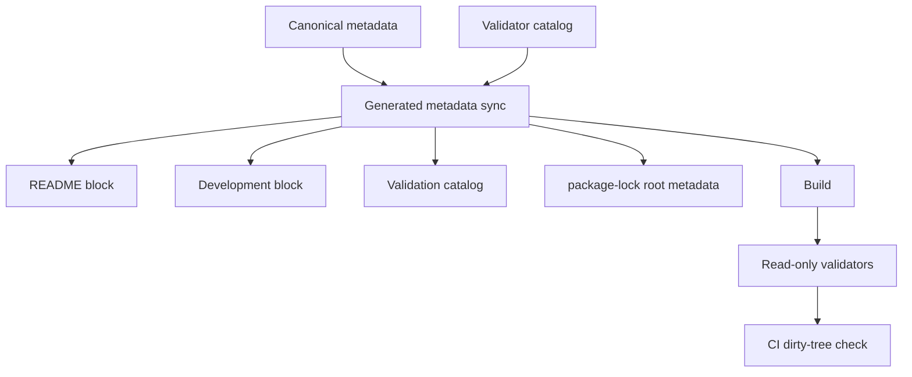

# Validation System

[Docs index](../README.md)

> **Navigation:** [Architecture overview](./README.md) → Validation System → [Authored Style Matching](./authored-style-matching-dom-snapshot.md)

## At a glance

| Concern | Canonical owner |
| --- | --- |
| Node/Electron baseline | `config/project-baseline.json` |
| Validator inventory | `scripts/validation/validation-suite.mjs` |
| Generated synchronization | `scripts/project-metadata/project-metadata-sync.mjs` |
| Change policy | `scripts/validate-change-policy.mjs` |
| Markdown integrity | `scripts/validate-markdown-integrity.mjs` |
| Process execution | `scripts/tooling/process-runner.mjs` |
| CI dirty-tree enforcement | `.github/workflows/validation.yml` |

## Purpose

The validation architecture separates canonical metadata, deterministic generation, read-only validators, branch change policy, and CI enforcement. It prevents stale lockfile root metadata, malformed Markdown, policy leakage, duplicated launchers, and manually maintained validator documentation.

## Current implementation

`npm run build` synchronizes generated metadata, then compiles HTML, SCSS, and TypeScript. Validators never write files; drift reports name `npm run sync:project-metadata` as the corrective command.

<!-- crystal-generated:validation-catalog:start -->
<!-- Do not edit manually. Run npm run sync:project-metadata. -->

Canonical checks: 31. Local quick checks: 31. Full validation checks: 31.

| Group | ID | Label | npm script | Required | Execution | Direct script |
| --- | --- | --- | --- | --- | --- | --- |
| Validation foundation | `validation-system` | Validation System | `validate:validation-system` | yes | direct-node | `scripts/validate-validation-system.mjs` |
| Generated metadata | `project-metadata` | Project Metadata | `validate:project-metadata` | yes | direct-node | `scripts/sync-project-metadata.mjs` |
| Change policy | `change-policy` | Change Policy | `validate:change-policy` | yes | direct-node | `scripts/validate-change-policy.mjs` |
| Documentation | `markdown-integrity` | Markdown Integrity | `validate:markdown-integrity` | yes | direct-node | `scripts/validate-markdown-integrity.mjs` |
| Documentation | `guided-docs` | Guided docs | `validate:guided-docs` | yes | direct-node | `scripts/validate-guided-docs.mjs` |
| Documentation | `architecture-docs` | Architecture docs | `validate:architecture-docs` | yes | direct-node | `scripts/validate-architecture-docs.mjs` |
| Build | `build-html` | Build HTML | `build:html` | yes | direct-node | `scripts/build-html.mjs` |
| Build | `build-scss` | Build SCSS | `build:scss` | yes | direct-node | `scripts/build-scss.mjs` |
| Build | `build-ts` | Build TS | `build:ts` | yes | direct-node | `scripts/build-ts.mjs` |
| Build | `typecheck` | Typecheck | `typecheck` | yes | npm | — |
| Core | `structure` | Structure | `validate:structure` | yes | direct-node | `scripts/validate-structure.mjs` |
| Core | `project-graph` | Project Graph | `validate:project-graph` | yes | direct-node | `scripts/validate-project-graph.mjs` |
| Core | `project-watch` | Project Watch | `validate:project-watch` | yes | direct-node | `scripts/validate-project-watch.mjs` |
| Core | `history-foundation` | History Foundation | `validate:history-foundation` | yes | direct-node | `scripts/validate-history-foundation.mjs` |
| Core | `design-editing-preflight` | Design Editing Preflight | `validate:design-editing-preflight` | yes | direct-node | `scripts/validate-design-editing-preflight.mjs` |
| Core | `inspector-editing-foundation` | Inspector Editing Foundation | `validate:inspector-editing-foundation` | yes | direct-node | `scripts/validate-inspector-editing-foundation.mjs` |
| Core | `style-engine-foundation` | Style Engine Foundation | `validate:style-engine-foundation` | yes | direct-node | `scripts/validate-style-engine-foundation.mjs` |
| Core | `authored-style-matching` | Authored Style Matching | `validate:authored-style-matching` | yes | direct-node | `scripts/validate-authored-style-matching.mjs` |
| Preview | `preview` | Preview | `validate:preview` | yes | direct-node | `scripts/validate-preview.mjs` |
| Preview | `dom-snapshot` | DOM Snapshot | `validate:dom-snapshot` | yes | direct-node | `scripts/validate-dom-snapshot.mjs` |
| Preview | `preview-selection` | Preview Selection | `validate:preview-selection` | yes | direct-node | `scripts/validate-preview-selection.mjs` |
| Preview | `preview-inspector` | Preview Inspector | `validate:preview-inspector` | yes | direct-node | `scripts/validate-preview-inspector.mjs` |
| UI | `design-canvas` | Design Canvas | `validate:design-canvas` | yes | direct-node | `scripts/validate-design-canvas.mjs` |
| UI | `visual-selection-overlay` | Visual Selection Overlay | `validate:visual-selection-overlay` | yes | direct-node | `scripts/validate-visual-selection-overlay.mjs` |
| UI | `html-element-library` | HTML Element Library | `validate:html-element-library` | yes | direct-node | `scripts/validate-html-element-library.mjs` |
| UI | `source-patch-preview` | Source Patch Preview | `validate:source-patch-preview` | yes | direct-node | `scripts/validate-source-patch-preview.mjs` |
| UI | `editable-inspector-surface` | Editable Inspector Surface | `validate:editable-inspector-surface` | yes | direct-node | `scripts/validate-editable-inspector-surface.mjs` |
| UI | `css-sass-inspector-surface` | CSS/Sass Inspector Surface | `validate:css-sass-inspector-surface` | yes | direct-node | `scripts/validate-css-sass-inspector-surface.mjs` |
| UI | `ui-flow` | UI Flow | `validate:ui-flow` | yes | direct-node | `scripts/validate-ui-flow.mjs` |
| Environment | `local-watch` | Local Watch | `validate:local:watch` | yes | direct-node | `scripts/validate-local-watch.mjs` |
| Environment | `electron-doctor` | Electron Doctor | `doctor:electron` | yes | direct-node | `scripts/doctor-electron.mjs` |
<!-- crystal-generated:validation-catalog:end -->

### Historical phase boundaries

Phase 6C models are planning-only. No file is modified. No DOM node is inserted. No patch is applied. No write IPC exists. These models must not write files.

Phase 6D — Design Editing MVP preflight. No source files are written. No patch apply is available. No write IPC exists. Apply remains unavailable. No undo/redo execution runs. Dirty-state is not persisted. No refresh execution runs. No Preview DOM mutation occurs.

Phase 7A — Editable Inspector draft/intent foundation. No source files are written. No patch apply is available. No write IPC exists. Apply remains unavailable. No contenteditable is used. No undo/redo execution runs. Dirty-state is not persisted. No refresh execution runs. No Preview DOM mutation occurs.

Phase 7B — Editable Inspector read-only draft surface. No source files are written. No patch apply is available. No write IPC exists. Apply remains unavailable. No contenteditable is used. No undo/redo execution runs. Dirty-state is not persisted. No refresh execution runs. No Preview DOM mutation occurs.

Phase 8A — Style Engine read-only source inventory foundation. No CSS/Sass Inspector visual surface is added. No real cascade is calculated. No computed styles are read. No style editing is implemented. No source files are written. No patch apply is available. No write IPC exists. Apply remains unavailable. No contenteditable is used. No undo/redo execution runs. Dirty-state is not persisted. No refresh execution runs. No Preview DOM mutation occurs.

Phase 8B — CSS/Sass Inspector read-only visual surface. No real cascade is calculated. No computed styles are read. No style editing is implemented. No source files are written. No patch apply is available. No write IPC exists. Apply remains unavailable. No contenteditable is used. No undo/redo execution runs. Dirty-state is not persisted. No refresh execution runs. No Preview DOM mutation occurs.

Phase 8C — Authored Style Matching over DOM Snapshot. No real cascade is calculated. No computed styles are read. No document.styleSheets or CSSOM is used. No iframe internals are read. No live Preview DOM matching is performed. No source files are written. No patch apply is available. No write IPC exists. Apply remains unavailable. No contenteditable is used. No undo/redo execution runs. Dirty-state is not persisted. No refresh execution runs. No Preview DOM mutation occurs.

## Key files

## Key files and responsibilities

| File | Responsibility |
| --- | --- |
| `config/project-baseline.json` | Canonical Node, npm, Electron, embedded Node, and Chromium baseline. |
| `scripts/project-metadata/project-baseline.mjs` | Schema and semver validation. |
| `scripts/project-metadata/project-metadata-sync.mjs` | Expected-output calculation and root lock metadata synchronization. |
| `scripts/validation/validation-suite.mjs` | Canonical catalog, grouping, counts, and generated aliases. |
| `scripts/validation/validation-runner.mjs` | Strict catalog execution and JSON reporting. |
| `scripts/validation/validation-meta.mjs` | Structural and behavioral meta-validation. |
| `scripts/validate-guided-docs.mjs` | Declarative documentation validation only. |
| `scripts/validate-change-policy.mjs` | Branch/base detection and NUL-delimited changed-file policy. |
| `scripts/tooling/process-runner.mjs` | Shell-free Node, npm, and executable launchers. |

## Data flow

## Boundaries

| Boundary | Permitted | Forbidden |
| --- | --- | --- |
| Synchronizer | Update marked blocks and root package metadata | Resolve packages or mutate transitives |
| Validator | Read, execute checks, report | Write repository files |
| Build | Run sync, then existing compilers | Query latest versions or run audit fixes |
| Change policy | Enforce branch-specific allowlists | Ban lockfiles globally |
| Process runner | Preserve argument arrays with `shell: false` | `shell: true`, `cmd.exe`, or flattened arguments |

Generated markers require exactly one ordered start/end pair, no duplicates, and no nesting. Content outside markers is preserved. LF and CRLF are supported; BOMs and forbidden control characters are rejected.

Root lock synchronization compares `name`, `version`, `workspaces`, dependency groups, and `engines`. It may update only `package-lock.json.packages[""]`. An incompatible direct dependency graph fails with `npm install` or `npm install --package-lock-only`; it never fabricates `resolved`, `integrity`, or transitive nodes.

## Validation

| Command | Behavior |
| --- | --- |
| `npm run sync:project-metadata` | Writes deterministic derived outputs. |
| `npm run validate:project-metadata` | Checks drift without writing. |
| `npm run validate:change-policy` | Enforces branch-specific file scope. |
| `npm run validate:markdown-integrity` | Detects controls, fences, markers, BOMs, and links. |
| `npm run validate:validation-system` | Validates catalog and tooling behavior. |
| `npm run validate:local:quick` | Executes the strict catalog-derived gate. |
| `npm --silent run validate:local:quick:json` | Emits JSON without banners or ANSI. |
| `npm run test:tooling-hardening` | Runs `node:test` regression fixtures. |

To add a validator, add its npm script and one catalog entry, then run `npm run build`; documentation, aliases, grouping, and counts are derived. To add a guided document, register it in `docs/metadata/documentation-contract.json`. To update Node/Electron, edit only `config/project-baseline.json`, resolve dependencies explicitly only when needed, then run build.

## What this does not do

| Not provided | Reason |
| --- | --- |
| Latest-version lookup | Build remains offline and reproducible. |
| Automatic dependency resolution | npm owns the package graph. |
| Validator autofix | Validators remain read-only. |
| Runtime feature work | This phase is tooling-only. |
| Warning suppression | Real warnings and stderr remain visible. |

## Common misunderstanding

> **Common misunderstanding:** build may write deterministic generated artifacts; validators never write. Generation and validation are separate execution boundaries.

## Related docs

- [Development environment](../development.md)
- [Guided reading](../guided-reading.md)
- [Validation flow](./flows/validation-flow.md)
- [Runtime boundaries](./runtime-boundaries.md)
- [Security model](./security-model.md)

## Future work

Broader AST-based semantic checks may replace remaining editorial token checks where behavior can be exercised safely. The catalog and read-only validator boundary remain authoritative.

## Read next

You are here: Validation System.

Why this matters: it defines what may generate files, what only observes them, and how CI proves generated outputs are committed.

Continue with [Authored Style Matching over DOM Snapshot](./authored-style-matching-dom-snapshot.md), then the [implementation roadmap](../roadmap-implementation.md).
