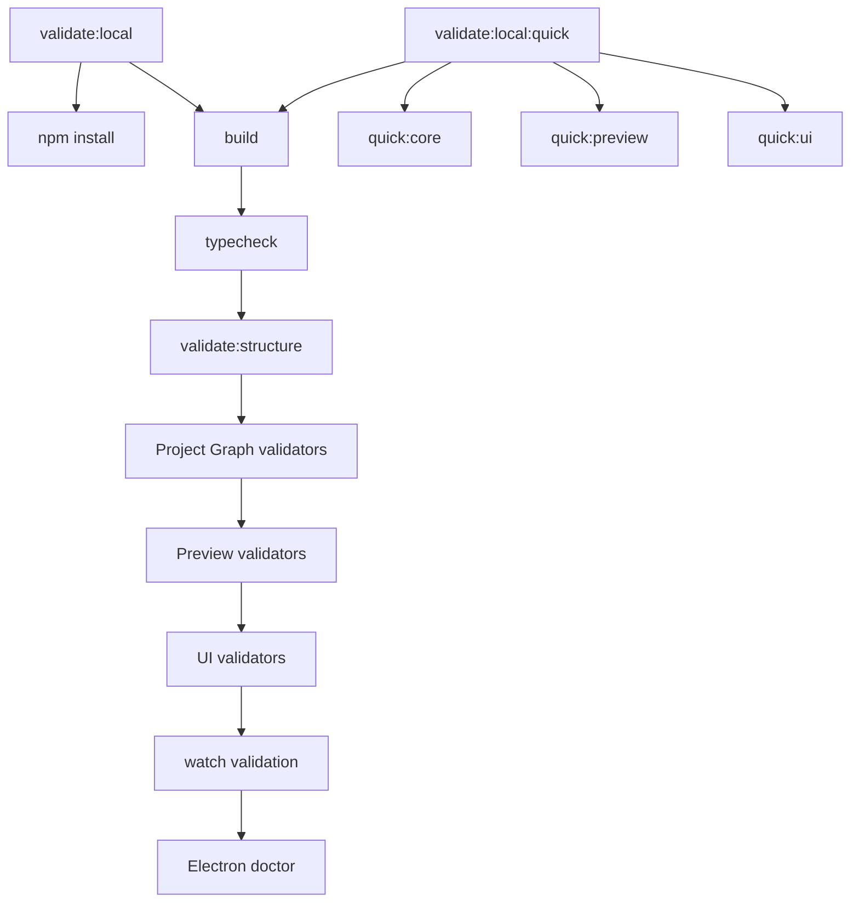

# Validation System

[Docs index](../README.md)

## Purpose

This document explains the local validation gates that keep Crystal's architecture conservative while features are added.

## Current implementation

Validation is script-based and dependency-light. The root `package.json` defines build, typecheck, feature validators, full local validation, quick validation groups, watcher validation, and Electron diagnostics. Validators are intentionally static or non-visual where possible.



## Key files

- `package.json`
- `scripts/validate-local.mjs`
- `scripts/validate-structure.mjs`
- `scripts/validate-project-graph.mjs`
- `scripts/validate-project-watch.mjs`
- `scripts/validate-preview.mjs`
- `scripts/validate-dom-snapshot.mjs`
- `scripts/validate-preview-selection.mjs`
- `scripts/validate-preview-inspector.mjs`
- `scripts/validate-design-canvas.mjs`
- `scripts/validate-visual-selection-overlay.mjs`
- `scripts/validate-html-element-library.mjs`
- `scripts/validate-source-patch-preview.mjs`
- `scripts/validate-ui-flow.mjs`
- `scripts/validate-architecture-docs.mjs`

## Data flow

Build validators check generated outputs indirectly through the build pipeline. Feature validators inspect source files, models, fixtures, or pure module behavior. Documentation validation checks that the new architecture docs exist, link back to the root docs index, include required sections, and include Mermaid diagrams.

## Boundaries

Validators must not add runtime behavior. They must not patch source files. They must fail with explicit messages when architecture boundaries drift. Documentation validation must not require new dependencies, binary assets, or external services.

## Validation

Run:

```bash
npm run validate:architecture-docs
npm run validate:local:quick
```

`validate:architecture-docs` is documentation-only and does not replace build/typecheck or feature validation.

## Related docs

- [Validation flow](./flows/validation-flow.md)
- [Validation gates diagram](./diagrams/validation-gates.md)
- [Repository map](./repository-map.md)
- [Roadmap implementation status](../roadmap-implementation.md)

## Future work

Future validators should cover import boundaries, docs-to-source reference drift, worker boundaries, WASM build outputs, WebGPU fallback paths, and write-command safety once those features exist.
