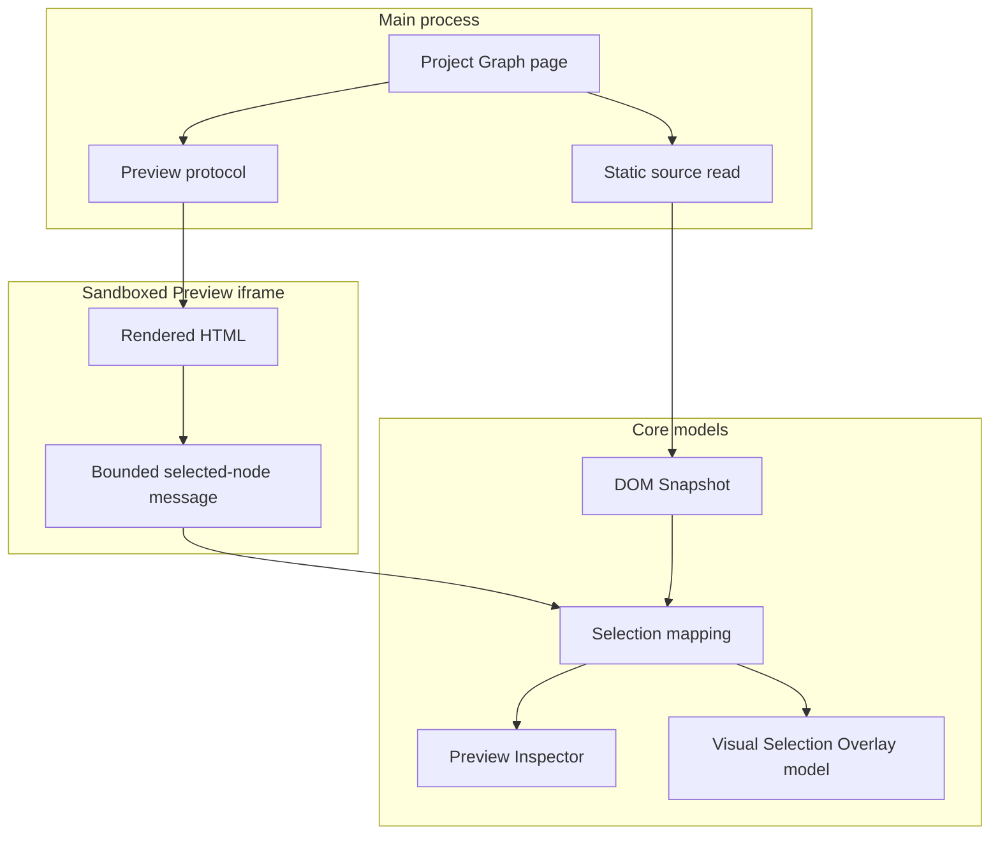
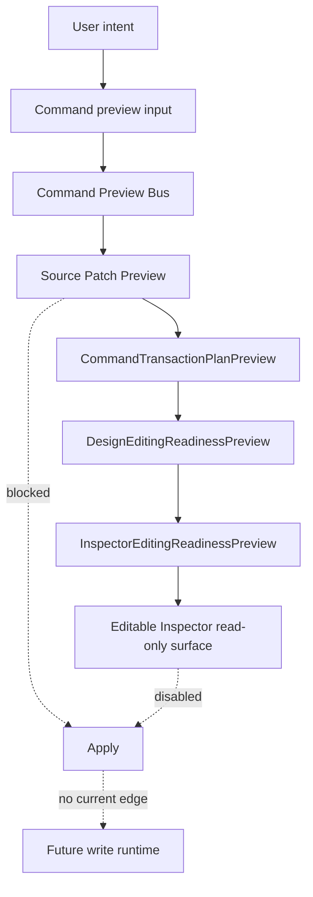

# Guided Reading

[Docs index](./README.md)

This page is the explicit reading route for Crystal documentation. It is not a second architecture spec. It tells contributors what to read first, what to read next, and which boundary must be understood before a change is made.

> **Navigation:** Start here → Core concepts → Electron/security model → Project Graph → Preview Pipeline → DOM Snapshot → Selection & Inspector → Editing Foundations → Style Engine Preparation → Validation System → Roadmap

## Main sequential path

Follow this route when onboarding or when a feature touches more than one subsystem.

| Order | Section | Read | Why it exists in the story |
| --- | --- | --- | --- |
| 1 | Get Started | [Docs index](./README.md) | Defines what Crystal is, what it is not yet, and how the docs are organized. |
| 2 | Roadmap status | [Roadmap implementation status](./roadmap-implementation.md) | Separates implemented foundations from blocked and future work. |
| 3 | Core concepts | [Glossary](./glossary.md) | Defines terms that encode safety boundaries. |
| 4 | System map | [Architecture overview](./architecture/README.md) | Connects runtime, Preview, commands, editing preflight, Style Engine, and validation. |
| 5 | Runtime authority | [Runtime boundaries](./architecture/runtime-boundaries.md) | Shows which context owns effects. |
| 6 | Electron security | [Security model](./architecture/security-model.md) | Explains why renderer and Preview authority are constrained. |
| 7 | Project Graph | [Project open flow](./architecture/flows/project-open-flow.md) | Shows how a project becomes safe, scanned state. |
| 8 | Preview Pipeline | [Preview architecture](./architecture/preview/README.md) | Explains real Chromium rendering without write authority. |
| 9 | DOM Snapshot | [DOM Snapshot](./architecture/preview/dom-snapshot.md) | Establishes source-derived structure as the trusted mapping surface. |
| 10 | Selection & Inspector | [Preview Selection](./architecture/preview/preview-selection.md) | Shows how bounded iframe messages become defensive selection state. |
| 11 | Inspector surface | [Preview Inspector](./architecture/preview/preview-inspector.md) | Shows how mapped selection becomes a read-only Inspector model. |
| 12 | Editing foundations | [Commands overview](./architecture/commands/README.md) | Shows why current commands are dry-run only. |
| 13 | Source patch preview | [Source Patch Preview](./architecture/commands/source-patch-preview.md) | Shows patch-like output without persistence. |
| 14 | Future write boundary | [Future write flow](./architecture/flows/future-write-flow.md) | Lists what must exist before Apply can be real. |
| 15 | Style Engine preparation | [Validation system](./architecture/validation-system.md) | Connects Phase 8A style inventory to future CSS/Sass Inspector work. |
| 16 | Validation | [Validation gates](./architecture/diagrams/validation-gates.md) | Shows how local checks enforce the documentation and runtime boundaries. |
| 17 | What comes next | [Full product roadmap](./full-product-roadmap.md) | Places the next CSS/Sass Inspector and later editing systems in the product sequence. |

```mermaid
flowchart LR
  Start[Docs index] --> Roadmap[Implementation status]
  Roadmap --> Glossary[Glossary]
  Glossary --> Architecture[Architecture overview]
  Architecture --> Runtime[Runtime boundaries]
  Runtime --> Security[Security model]
  Security --> Graph[Project open flow]
  Graph --> Preview[Preview architecture]
  Preview --> Snapshot[DOM Snapshot]
  Snapshot --> Selection[Preview Selection]
  Selection --> Inspector[Preview Inspector]
  Inspector --> Commands[Commands overview]
  Commands --> Patch[Source Patch Preview]
  Patch --> Write[Future write flow]
  Write --> Style[Style Engine preparation]
  Style --> Validation[Validation system]
  Validation --> Next[Full roadmap]
```

## Paths by objective

| Objective | Read first | Then read | Read next |
| --- | --- | --- | --- |
| Touch code safely as a new contributor | [Architecture overview](./architecture/README.md) | [Runtime boundaries](./architecture/runtime-boundaries.md), [Validation system](./architecture/validation-system.md) | [Glossary](./glossary.md) |
| Change Electron/security behavior | [Security model](./architecture/security-model.md) | [Runtime boundaries](./architecture/runtime-boundaries.md), [Preview safety](./architecture/preview/preview-safety.md), [ADR 0001](./decisions/0001-electron-security-boundaries.md) | [Security boundaries diagram](./architecture/diagrams/security-boundaries.md) |
| Change Preview or iframe behavior | [Preview architecture](./architecture/preview/README.md) | [Project Preview](./architecture/preview/project-preview.md), [Preview safety](./architecture/preview/preview-safety.md) | [DOM Snapshot](./architecture/preview/dom-snapshot.md) |
| Change DOM Snapshot or selection | [DOM Snapshot](./architecture/preview/dom-snapshot.md) | [Preview Selection](./architecture/preview/preview-selection.md), [DOM Snapshot flow](./architecture/flows/dom-snapshot-flow.md) | [Preview selection flow](./architecture/flows/preview-selection-flow.md) |
| Change Inspector or overlay surfaces | [Preview Inspector](./architecture/preview/preview-inspector.md) | [Visual Selection Overlay](./architecture/preview/visual-selection-overlay.md) | [Future write flow](./architecture/flows/future-write-flow.md) |
| Change command preview behavior | [Commands overview](./architecture/commands/README.md) | [Command Preview Bus](./architecture/commands/command-preview-bus.md), [Source Patch Preview](./architecture/commands/source-patch-preview.md) | [Future command execution](./architecture/commands/future-command-execution.md) |
| Change editing/source patch foundations | [Source Patch Preview](./architecture/commands/source-patch-preview.md) | [Source Patch Preview flow](./architecture/flows/source-patch-preview-flow.md), [Future write flow](./architecture/flows/future-write-flow.md) | [ADR 0003](./decisions/0003-command-preview-before-write.md) |
| Change Style Engine or future CSS/Sass Inspector prep | [Roadmap implementation status](./roadmap-implementation.md) | [Glossary](./glossary.md), [Validation system](./architecture/validation-system.md) | [Future write flow](./architecture/flows/future-write-flow.md) |
| Change docs or validators | [Validation system](./architecture/validation-system.md) | [Validation flow](./architecture/flows/validation-flow.md), [Validation gates](./architecture/diagrams/validation-gates.md) | [Architecture docs validator](../scripts/validate-architecture-docs.mjs) |

## Before touching code

| You plan to touch | Read first | Required boundary |
| --- | --- | --- |
| `apps/desktop/electron/main` | [Runtime boundaries](./architecture/runtime-boundaries.md) | Main owns privileged effects; renderer does not. |
| `apps/desktop/electron/preload` | [Security model](./architecture/security-model.md) | Preload narrows access; it must not expose raw IPC. |
| `apps/desktop/electron/renderer` | [Module boundaries](./architecture/module-boundaries.md) | Renderer is browser UI and must not gain filesystem authority. |
| Preview iframe behavior | [Preview safety](./architecture/preview/preview-safety.md) | Do not use live iframe DOM access. |
| DOM Snapshot parsing | [DOM Snapshot](./architecture/preview/dom-snapshot.md) | Snapshot is source-derived, not the live DOM. |
| Selection mapping | [Preview Selection](./architecture/preview/preview-selection.md) | Selection is defensive until mapped to snapshot state. |
| Command preview | [Command Preview Bus](./architecture/commands/command-preview-bus.md) | Preview bus is not command execution. |
| Source patch preview | [Source Patch Preview](./architecture/commands/source-patch-preview.md) | Patch preview must not write or apply. |
| Editable Inspector | [Future write flow](./architecture/flows/future-write-flow.md) | Inspector draft/intent and read-only surface remain Apply-blocked. |
| Style Engine | [Validation system](./architecture/validation-system.md) | Source inventory is not cascade, computed styles, or style editing. |
| Documentation validators | [Validation flow](./architecture/flows/validation-flow.md) | Validators read and fail; they do not mutate source. |

## Before implementing a feature

1. Read [Roadmap implementation status](./roadmap-implementation.md) to verify whether the feature is current, blocked, or future.
2. Read the subsystem overview for the area you will touch.
3. Read the closest flow document to understand the existing data movement.
4. Read [Validation system](./architecture/validation-system.md) and the relevant validator script before changing code.
5. Do not claim a capability unless both implementation and validation support it.

## Before touching Electron security

| Read | Reason |
| --- | --- |
| [Runtime boundaries](./architecture/runtime-boundaries.md) | Defines main/preload/renderer authority. |
| [Security model](./architecture/security-model.md) | Documents `contextIsolation`, `nodeIntegration`, sandbox, and web security expectations. |
| [Preview safety](./architecture/preview/preview-safety.md) | Protects the user project iframe from privileged reads and mutation. |
| [ADR 0001](./decisions/0001-electron-security-boundaries.md) | Records the security boundary decision. |

Read next: [Security boundaries diagram](./architecture/diagrams/security-boundaries.md).

## Before touching Preview or iframe behavior

| Read | Reason |
| --- | --- |
| [Preview architecture](./architecture/preview/README.md) | Shows the complete rendering/snapshot/selection/Inspector path. |
| [Project Preview](./architecture/preview/project-preview.md) | Documents safe project-relative serving. |
| [Preview safety](./architecture/preview/preview-safety.md) | Lists forbidden iframe and DOM shortcuts. |
| [DOM Snapshot](./architecture/preview/dom-snapshot.md) | Explains why source-derived structure is the trusted bridge. |

Read next: [Preview pipeline path](#preview-pipeline-path).

## Before touching editing or source patches

| Read | Reason |
| --- | --- |
| [Commands overview](./architecture/commands/README.md) | Defines dry-run command architecture. |
| [Source Patch Preview](./architecture/commands/source-patch-preview.md) | Documents patch-like preview without apply. |
| [Future command execution](./architecture/commands/future-command-execution.md) | Shows future execution requirements. |
| [Future write flow](./architecture/flows/future-write-flow.md) | Lists the write boundary and blocked states. |
| [ADR 0003](./decisions/0003-command-preview-before-write.md) | Records command-preview-before-write decision. |

Read next: [Editing foundation path](#editing-foundation-path).

## Before touching docs or validators

| Read | Reason |
| --- | --- |
| [Validation system](./architecture/validation-system.md) | Explains the validator graph and what each gate proves. |
| [Validation flow](./architecture/flows/validation-flow.md) | Shows how validation runs through docs and runtime checks. |
| [Validation gates](./architecture/diagrams/validation-gates.md) | Visualizes the local gate sequence. |
| [`scripts/validate-architecture-docs.mjs`](../scripts/validate-architecture-docs.mjs) | Existing architecture docs validator. |
| [`scripts/validate-guided-docs.mjs`](../scripts/validate-guided-docs.mjs) | Guided reading and navigation validator. |

Read next: [Roadmap implementation status](./roadmap-implementation.md), to confirm no phase boundary language was removed.

## Preview pipeline path

Read next:
- [Project Preview](./architecture/preview/project-preview.md)
- [DOM Snapshot](./architecture/preview/dom-snapshot.md)
- [Preview Selection](./architecture/preview/preview-selection.md)
- [Preview Inspector](./architecture/preview/preview-inspector.md)

Why this matters:
Preview is the bridge between real rendering and trusted source reasoning. It must not become a shortcut around Electron security or source ownership.

## Editing foundation path

Read next:
- [Commands overview](./architecture/commands/README.md)
- [Source Patch Preview](./architecture/commands/source-patch-preview.md)
- [Future command execution](./architecture/commands/future-command-execution.md)
- [Future write flow](./architecture/flows/future-write-flow.md)

Why this matters:
Editing foundations make future mutation explicit without implementing mutation. Dry-run objects, readiness summaries, and disabled UI must stay separate from write execution.

## Style Engine and CSS/Sass Inspector preparation

| Concept | Current status | Next dependency |
| --- | --- | --- |
| Style source inventory | Phase 8A read-only contracts. | Future CSS/Sass Inspector visual surface. |
| Selector preview | Textual, match status remains not evaluated. | Authored-style matching against DOM Snapshot. |
| Declaration preview | `canEdit: false`, `canApply: false`. | Write ownership and style source policy. |
| Rule preview | Textual composition only. | Cascade and specificity analysis. |
| Selected-node style readiness | Apply and computed styles blocked. | Authored/computed style correlation. |

Read next:
- [Glossary](./glossary.md)
- [Validation system](./architecture/validation-system.md)
- [Future write flow](./architecture/flows/future-write-flow.md)

Why this matters:
Style Engine preparation is not style editing. It creates read-only source inventory so the next CSS/Sass Inspector work can be validated before any cascade, computed style, or write-capable feature appears.

## Read next

You are here: Guided reading.

Before this:
- [Docs index](./README.md)

Next:
- [Architecture overview](./architecture/README.md)

Related:
- [Roadmap implementation status](./roadmap-implementation.md)
- [Glossary](./glossary.md)
- [Validation system](./architecture/validation-system.md)

Why this matters:
This page turns the documentation set into a connected reading path. It makes each subsystem's place in the architecture explicit before a contributor follows links into implementation-specific pages.
