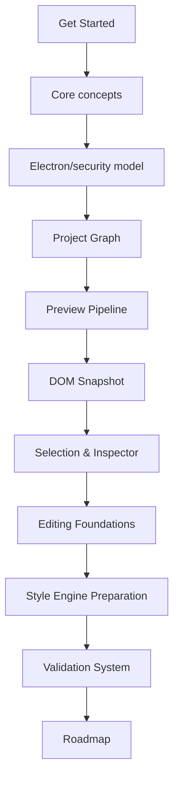
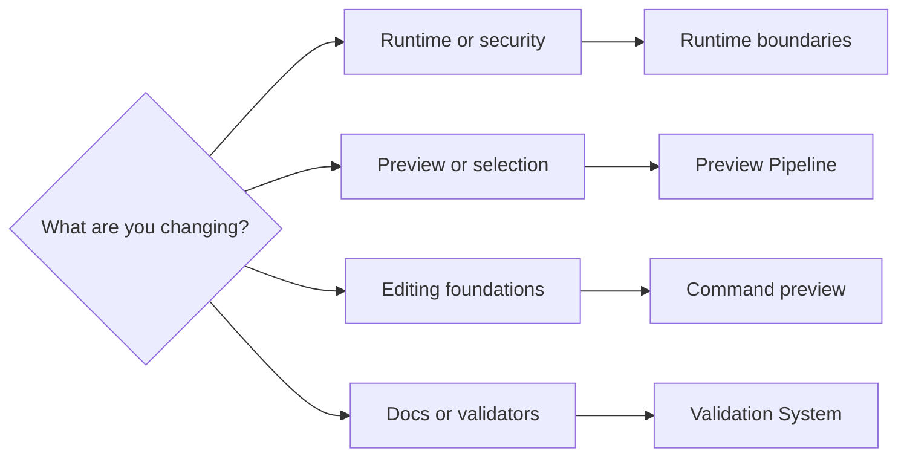
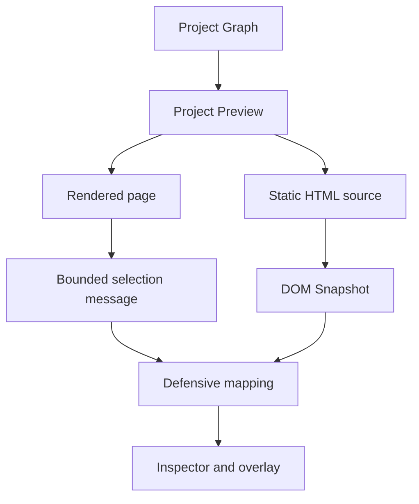

# Guided reading

[Docs index](./README.md)

This page is a navigation tool, not a prerequisite checklist. Choose the path that matches the decision you need to make; follow the main path when you need a complete model of the system.

## Main sequential path

1. [Repository README](../README.md) — Get Started and establish the current product boundary.
2. [System overview](./architecture/system-overview.md) — Core concepts and the read-only/dry-run product loop.
3. [Security model](./architecture/security-model.md) — Electron/security model and authority.
4. [Project open flow](./architecture/flows/project-open-flow.md) — Project Graph creation and filesystem ownership.
5. [Preview architecture](./architecture/preview/README.md) — Preview Pipeline and iframe isolation.
6. [DOM Snapshot](./architecture/preview/dom-snapshot.md) — the source-derived structural model.
7. [Preview Selection](./architecture/preview/preview-selection.md) and [Preview Inspector](./architecture/preview/preview-inspector.md) — Selection & Inspector.
8. [Commands architecture](./architecture/commands/README.md) — Editing Foundations without execution.
9. [CSS/Sass Inspector surface](./architecture/css-sass-inspector-readonly-surface.md) — Style Engine Preparation.
10. [Validation system](./architecture/validation-system.md) — executable gates and reporting semantics.
11. [Implementation status](./roadmap-implementation.md) — Roadmap status grounded in source and validators.

## Paths by objective

Use the shortest path that still exposes the relevant authority boundary. A renderer-only visual adjustment does not require reading the whole roadmap, but a preload change does require the security model and IPC contracts.

## Before touching code

Read [Repository map](./architecture/repository-map.md), [Module boundaries](./architecture/module-boundaries.md), and [Development](./development.md). Confirm which runtime owns the behavior and which validator currently guards it.

## Before implementing a feature

Read [System overview](./architecture/system-overview.md), the subsystem README, the closest flow, and [Implementation status](./roadmap-implementation.md). The flow usually reveals missing handoffs that a file-by-file reading obscures.

## Before touching Electron security

Read [Runtime boundaries](./architecture/runtime-boundaries.md), [Security model](./architecture/security-model.md), [Preview safety](./architecture/preview/preview-safety.md), and [ADR 0001](./decisions/0001-electron-security-boundaries.md). Do not use renderer convenience as a reason to weaken `contextIsolation`, sandboxing, web security, or iframe isolation.

## Before touching Preview or iframe behavior

Read [Preview architecture](./architecture/preview/README.md), [Project Preview](./architecture/preview/project-preview.md), [DOM Snapshot](./architecture/preview/dom-snapshot.md), and [Preview Selection](./architecture/preview/preview-selection.md). Keep browser-rendered state and source-derived state distinct.

## Before touching editing or source patches

Read [Commands architecture](./architecture/commands/README.md), [Source Patch Preview](./architecture/commands/source-patch-preview.md), [Command Preview Bus](./architecture/commands/command-preview-bus.md), [Future write flow](./architecture/flows/future-write-flow.md), and [ADR 0003](./decisions/0003-command-preview-before-write.md). Current models can describe and validate intent; they cannot execute it.

## Before touching docs or validators

Read [Validation system](./architecture/validation-system.md), [Validation platform hardening](./architecture/validation-platform-hardening-phase-2.md), and [Validation flow](./architecture/flows/validation-flow.md). Preserve generated blocks and run the documentation-specific gates before the aggregate suite.

## Preview pipeline path

1. [Project Preview](./architecture/preview/project-preview.md)
2. [DOM Snapshot](./architecture/preview/dom-snapshot.md)
3. [Preview Selection](./architecture/preview/preview-selection.md)
4. [Preview Inspector](./architecture/preview/preview-inspector.md)
5. [Visual Selection Overlay](./architecture/preview/visual-selection-overlay.md)
6. [Preview safety](./architecture/preview/preview-safety.md)

This path explains why rendering, structural reasoning, mapping, and projection are separate operations.

## Editing foundation path

1. [HTML Element Library](./architecture/commands/html-element-library.md)
2. [HTML insertion preview planner](./architecture/commands/html-insertion-preview-planner.md)
3. [Source Patch Preview](./architecture/commands/source-patch-preview.md)
4. [Command Preview Bus](./architecture/commands/command-preview-bus.md)
5. [Future command execution](./architecture/commands/future-command-execution.md)
6. [Future write flow](./architecture/flows/future-write-flow.md)

The path ends at a blocked write boundary. It does not culminate in a hidden writer.

## Style Engine and CSS/Sass Inspector preparation

Read [CSS/Sass Inspector read-only visual surface](./architecture/css-sass-inspector-readonly-surface.md), then [Authored Style Matching over DOM Snapshot](./architecture/authored-style-matching-dom-snapshot.md). The first page explains source inventory and presentation; the second explains conservative selector candidates. Neither page describes real cascade, computed styles, CSSOM access, live-DOM matching, or style editing.

## Read next

You are here: guided reading and task routing.

Next:
- [Architecture overview](./architecture/README.md) for the full ownership model.
- [Glossary](./glossary.md) when a term changes meaning across Preview, source, and future editing contexts.

Why this matters:
A correct reading order prevents a preview object, planner, UI surface, or roadmap phase from being promoted into a capability the runtime does not have.
